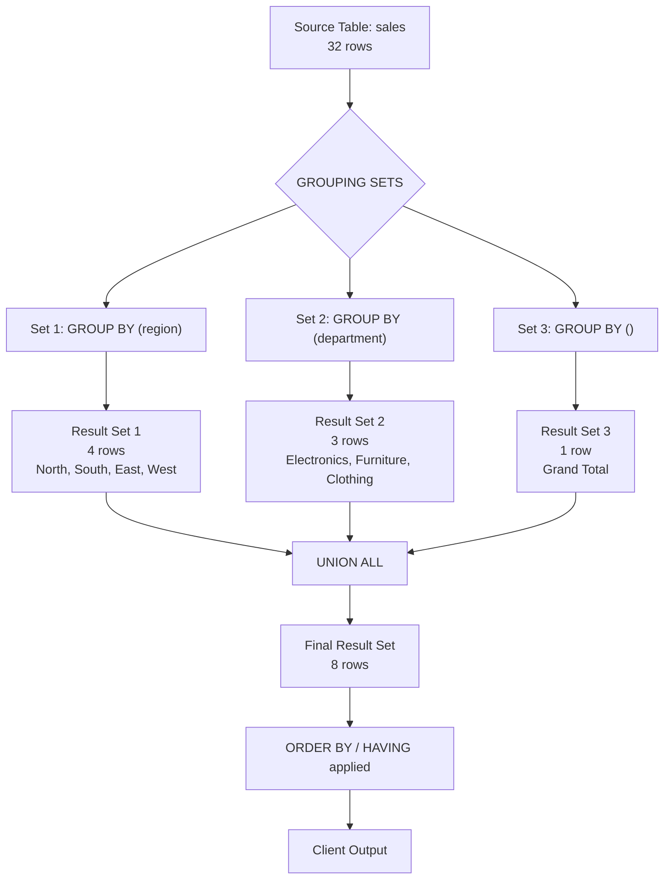
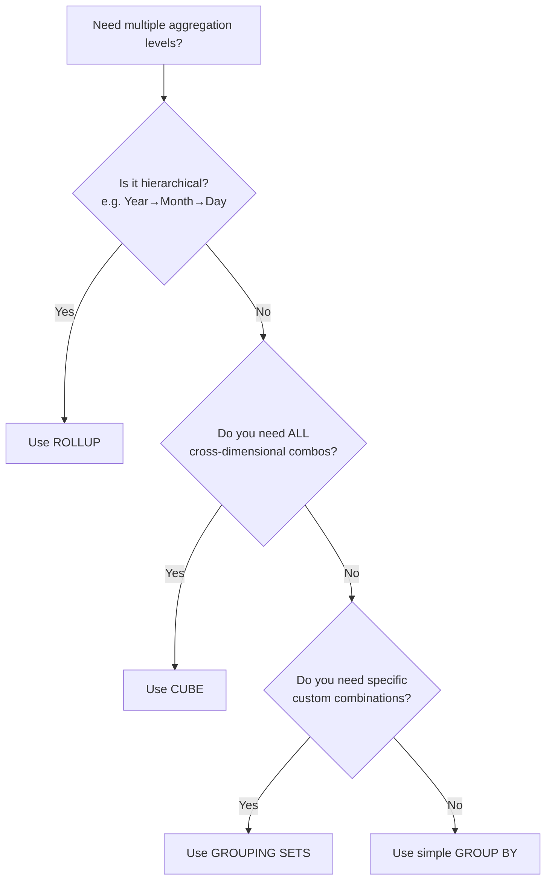

# SQL GROUPING SETS: Complete Practical Guide

> **Audience:** Beginner to Intermediate Data Analysts, BI Developers, Data Engineers, SQL Learners
> **Database:** PostgreSQL-compatible syntax
> **Difficulty:** ⭐⭐⭐ Intermediate

---

## Table of Contents

1. [Introduction](#1-introduction)
2. [Prerequisites](#2-prerequisites)
3. [Understanding the Problem](#3-understanding-the-problem)
4. [GROUPING SETS Syntax](#4-grouping-sets-syntax)
5. [Sample Dataset](#5-sample-dataset)
6. [First GROUPING SETS Example](#6-first-grouping-sets-example)
7. [How SQL Processes GROUPING SETS](#7-how-sql-processes-grouping-sets)
8. [Multiple Business Scenarios](#8-multiple-business-scenarios)
9. [GROUPING() Function](#9-grouping-function)
10. [GROUPING_ID() Function](#10-grouping_id-function)
11. [GROUPING SETS vs UNION ALL](#11-grouping-sets-vs-union-all)
12. [GROUPING SETS vs ROLLUP](#12-grouping-sets-vs-rollup)
13. [GROUPING SETS vs CUBE](#13-grouping-sets-vs-cube)
14. [Performance Considerations](#14-performance-considerations)
15. [Common Mistakes](#15-common-mistakes)
16. [Real-world Use Cases](#16-real-world-use-cases)
17. [Interview Questions](#17-interview-questions)
18. [Practice Exercises](#18-practice-exercises)
19. [Solutions](#19-solutions)
20. [Summary Cheat Sheet](#20-summary-cheat-sheet)

---

## 1. Introduction

### What Are GROUPING SETS?

**GROUPING SETS** is an advanced SQL extension to the `GROUP BY` clause that allows you to define **multiple grouping combinations in a single query**. Instead of writing several separate `GROUP BY` queries and combining them with `UNION ALL`, you specify all the grouping combinations you need in one concise statement.

Think of GROUPING SETS as a way of saying:

> *"Show me my data aggregated by Region, then by Department, then by Product Category — all in one result set."*

```sql
-- With GROUPING SETS (one query)
SELECT region, department, SUM(sales_amount)
FROM sales
GROUP BY GROUPING SETS (
    (region),
    (department),
    ()
);
```

### Why Were GROUPING SETS Introduced?

Before GROUPING SETS, analysts had to write multiple `SELECT` statements and combine them using `UNION ALL`. This approach was:

- **Verbose** — repetitive boilerplate code
- **Error-prone** — mismatched columns between UNION branches
- **Inefficient** — the database scanned the same table multiple times
- **Hard to maintain** — any schema change required updating multiple queries

GROUPING SETS were introduced as part of the **SQL:1999 standard** and are now supported by major databases including PostgreSQL, Oracle, SQL Server, BigQuery, Snowflake, and Redshift.

### Business Problems They Solve

| Business Need | Without GROUPING SETS | With GROUPING SETS |
|---|---|---|
| Multi-dimensional sales reports | 4–6 separate queries | 1 query |
| Executive dashboards | Complex UNION ALL chains | Clean single query |
| Financial roll-ups | Manual aggregation tiers | Declarative grouping |
| BI tool data feeds | Multiple table scans | Single pass aggregation |
| Ad-hoc pivot analysis | Custom queries per view | Flexible grouping sets |

---

## 2. Prerequisites

Before diving into GROUPING SETS, you should be comfortable with the following concepts.

### GROUP BY Review

`GROUP BY` collapses rows with the same values in the specified columns into summary rows.

```sql
-- Count employees per department
SELECT
    department,
    COUNT(*)     AS employee_count,
    AVG(salary)  AS avg_salary
FROM employees
GROUP BY department;
```

**Key Rules:**
- Every column in `SELECT` must either be in `GROUP BY` or wrapped in an aggregate function
- `NULL` values in grouping columns are treated as one group
- Results are returned in an unspecified order unless you add `ORDER BY`

### Aggregate Functions Review

| Function | Description | Example |
|---|---|---|
| `SUM()` | Total of all values | `SUM(sales_amount)` |
| `COUNT()` | Number of rows | `COUNT(*)` |
| `AVG()` | Arithmetic mean | `AVG(unit_price)` |
| `MIN()` | Smallest value | `MIN(order_date)` |
| `MAX()` | Largest value | `MAX(sales_amount)` |
| `STDDEV()` | Standard deviation | `STDDEV(revenue)` |
| `STRING_AGG()` | Concatenate strings | `STRING_AGG(name, ',')` |

```sql
-- Using multiple aggregate functions
SELECT
    region,
    COUNT(*)                              AS total_orders,
    SUM(sales_amount)                     AS total_revenue,
    AVG(sales_amount)                     AS avg_order_value,
    MIN(sales_amount)                     AS min_sale,
    MAX(sales_amount)                     AS max_sale
FROM sales
GROUP BY region;
```

---

## 3. Understanding the Problem

### The Traditional Approach

Imagine you are a data analyst at a retail company. Your manager asks for a report showing:

1. **Total sales by Region**
2. **Total sales by Department**
3. **Total sales by Product Category**
4. **Grand total across everything**

A traditional SQL developer would write four separate queries:

```sql
-- Query 1: Sales by Region
SELECT
    region,
    NULL         AS department,
    NULL         AS product_category,
    SUM(sales_amount) AS total_sales
FROM sales
GROUP BY region;
```

```sql
-- Query 2: Sales by Department
SELECT
    NULL         AS region,
    department,
    NULL         AS product_category,
    SUM(sales_amount) AS total_sales
FROM sales
GROUP BY department;
```

```sql
-- Query 3: Sales by Product Category
SELECT
    NULL         AS region,
    NULL         AS department,
    product_category,
    SUM(sales_amount) AS total_sales
FROM sales
GROUP BY product_category;
```

```sql
-- Query 4: Grand Total
SELECT
    NULL         AS region,
    NULL         AS department,
    NULL         AS product_category,
    SUM(sales_amount) AS total_sales
FROM sales;
```

### Combining With UNION ALL

```sql
-- Final combined result
SELECT region, NULL AS department, NULL AS product_category, SUM(sales_amount) AS total_sales
FROM sales GROUP BY region

UNION ALL

SELECT NULL, department, NULL, SUM(sales_amount)
FROM sales GROUP BY department

UNION ALL

SELECT NULL, NULL, product_category, SUM(sales_amount)
FROM sales GROUP BY product_category

UNION ALL

SELECT NULL, NULL, NULL, SUM(sales_amount)
FROM sales;
```

### Problems With This Approach

> ⚠️ **This approach has serious drawbacks:**

1. **Four separate table scans** — the database reads the `sales` table four times
2. **Massive code duplication** — the same `FROM` clause and table appear four times
3. **Brittle maintenance** — adding a new dimension requires adding another `UNION ALL` branch
4. **Column alignment errors** — it's easy to misalign `NULL` columns across branches
5. **Query optimiser limitation** — the database treats these as four independent queries, losing optimisation opportunities

---

## 4. GROUPING SETS Syntax

### Core Syntax

```sql
SELECT
    column1,
    column2,
    column3,
    aggregate_function(column4) AS alias
FROM table_name
GROUP BY GROUPING SETS (
    (column1, column2),   -- Grouping combination 1
    (column1),            -- Grouping combination 2
    (column2, column3),   -- Grouping combination 3
    ()                    -- Grand total (empty set)
);
```

### Syntax Breakdown

| Component | Description |
|---|---|
| `GROUPING SETS` | Keyword that replaces or extends `GROUP BY` |
| `(column1, column2)` | A grouping combination — like a mini `GROUP BY` |
| `(column1)` | Single-column grouping |
| `()` | **Empty set** — produces the grand total row |
| Multiple sets | Separated by commas inside the outer parentheses |

### Rules and Constraints

```sql
-- ✅ Valid: Multiple grouping combinations
GROUP BY GROUPING SETS ((region), (department), ())

-- ✅ Valid: Composite keys
GROUP BY GROUPING SETS ((region, year), (department, year))

-- ✅ Valid: Single set (equivalent to regular GROUP BY)
GROUP BY GROUPING SETS ((region))

-- ✅ Valid: Mixing with other expressions
GROUP BY GROUPING SETS ((region), (EXTRACT(YEAR FROM sale_date)))

-- ❌ Invalid: Aggregate functions inside GROUPING SETS
GROUP BY GROUPING SETS ((SUM(sales_amount)))  -- NOT allowed
```

> 💡 **Tip:** The empty set `()` is how you produce a grand total row in GROUPING SETS. Without it, no grand total row is generated.

---

## 5. Sample Dataset

Let's create a realistic sales dataset that we'll use throughout this guide.

### Table Definition

```sql
-- Create the sales table
CREATE TABLE sales (
    sale_id          SERIAL PRIMARY KEY,
    sale_date        DATE            NOT NULL,
    region           VARCHAR(50)     NOT NULL,
    department       VARCHAR(50)     NOT NULL,
    product_category VARCHAR(50)     NOT NULL,
    sales_rep        VARCHAR(100)    NOT NULL,
    sales_amount     NUMERIC(10, 2)  NOT NULL,
    units_sold       INT             NOT NULL
);
```

### Sample Data

```sql
-- Insert sample sales data
INSERT INTO sales (sale_date, region, department, product_category, sales_rep, sales_amount, units_sold)
VALUES
    -- North Region
    ('2024-01-05', 'North', 'Electronics',  'Laptops',      'Alice Kim',    1200.00, 2),
    ('2024-01-07', 'North', 'Electronics',  'Phones',       'Bob Lee',       450.00, 3),
    ('2024-01-10', 'North', 'Furniture',    'Chairs',       'Carol Wong',    320.00, 4),
    ('2024-01-12', 'North', 'Furniture',    'Desks',        'David Park',    780.00, 1),
    ('2024-01-15', 'North', 'Clothing',     'Tops',         'Alice Kim',     210.00, 7),
    ('2024-01-18', 'North', 'Electronics',  'Laptops',      'Bob Lee',      1500.00, 1),
    ('2024-01-22', 'North', 'Clothing',     'Pants',        'Carol Wong',    175.00, 5),
    ('2024-01-25', 'North', 'Furniture',    'Chairs',       'David Park',    640.00, 2),

    -- South Region
    ('2024-01-06', 'South', 'Electronics',  'Phones',       'Emma Davis',    900.00, 6),
    ('2024-01-08', 'South', 'Electronics',  'Tablets',      'Frank Moore',   650.00, 2),
    ('2024-01-11', 'South', 'Clothing',     'Tops',         'Grace Hall',    280.00, 9),
    ('2024-01-14', 'South', 'Furniture',    'Desks',        'Henry Adams',   950.00, 2),
    ('2024-01-17', 'South', 'Electronics',  'Laptops',      'Emma Davis',   1350.00, 3),
    ('2024-01-19', 'South', 'Clothing',     'Pants',        'Frank Moore',   220.00, 8),
    ('2024-01-23', 'South', 'Furniture',    'Chairs',       'Grace Hall',    480.00, 3),
    ('2024-01-27', 'South', 'Electronics',  'Phones',       'Henry Adams',   720.00, 4),

    -- East Region
    ('2024-01-04', 'East',  'Electronics',  'Tablets',      'Iris Chen',     580.00, 3),
    ('2024-01-09', 'East',  'Furniture',    'Desks',        'Jack Brown',    860.00, 1),
    ('2024-01-13', 'East',  'Clothing',     'Tops',         'Kara White',    195.00, 6),
    ('2024-01-16', 'East',  'Electronics',  'Phones',       'Leo Turner',    530.00, 5),
    ('2024-01-20', 'East',  'Electronics',  'Laptops',      'Iris Chen',    1100.00, 2),
    ('2024-01-24', 'East',  'Clothing',     'Pants',        'Jack Brown',    155.00, 4),
    ('2024-01-26', 'East',  'Furniture',    'Chairs',       'Kara White',    370.00, 2),
    ('2024-01-29', 'East',  'Electronics',  'Tablets',      'Leo Turner',    620.00, 4),

    -- West Region
    ('2024-01-03', 'West',  'Furniture',    'Desks',        'Mia Scott',     920.00, 2),
    ('2024-01-05', 'West',  'Electronics',  'Laptops',      'Nate Young',   1400.00, 1),
    ('2024-01-10', 'West',  'Clothing',     'Tops',         'Olivia King',   250.00, 8),
    ('2024-01-14', 'West',  'Electronics',  'Phones',       'Pete Clark',    680.00, 7),
    ('2024-01-18', 'West',  'Furniture',    'Chairs',       'Mia Scott',     510.00, 3),
    ('2024-01-21', 'West',  'Clothing',     'Pants',        'Nate Young',    195.00, 6),
    ('2024-01-25', 'West',  'Electronics',  'Tablets',      'Olivia King',   740.00, 5),
    ('2024-01-28', 'West',  'Furniture',    'Desks',        'Pete Clark',    870.00, 1);
```

### Data Overview

| Dimension | Values |
|---|---|
| Regions | North, South, East, West |
| Departments | Electronics, Furniture, Clothing |
| Product Categories | Laptops, Phones, Tablets, Desks, Chairs, Tops, Pants |
| Date Range | January 2024 |
| Total Rows | 32 |

---

## 6. First GROUPING SETS Example

### Step 1: Define the Goal

We want a single result set showing:
- Total sales **by Region**
- Total sales **by Department**
- **Grand total** of all sales

### Step 2: Write the Query

```sql
SELECT
    region,
    department,
    SUM(sales_amount) AS total_sales
FROM sales
GROUP BY GROUPING SETS (
    (region),       -- Group 1: aggregate by region
    (department),   -- Group 2: aggregate by department
    ()              -- Group 3: grand total
)
ORDER BY
    GROUPING(region),
    GROUPING(department);
```

### Step 3: Understand the Output

```
 region  | department  | total_sales
---------+-------------+------------
 East    |             |   4210.00
 North   |             |   5275.00
 South   |             |   5550.00
 West    |             |   4565.00
         | Clothing    |   1680.00
         | Electronics |  10700.00  
         | Furniture   |   7220.00  (approximate totals)
         |             |  19600.00
```

### Step 4: Interpret the NULLs

> ⚠️ **Important:** When you see `NULL` in the output of a GROUPING SETS query, it means **"aggregated across all values of that column"** — not a missing or unknown value.

| row | region | department | Meaning |
|---|---|---|---|
| 1–4 | `'North'` etc. | `NULL` | Grouped by Region only — department is not relevant |
| 5–7 | `NULL` | `'Electronics'` etc. | Grouped by Department only — region is not relevant |
| 8 | `NULL` | `NULL` | Grand total — no grouping applied |

---

## 7. How SQL Processes GROUPING SETS

### Conceptual Flow



### Internal Execution Steps

1. **Parse** — SQL engine identifies all grouping sets
2. **Scan** — The `sales` table is scanned (ideally once, depending on the engine)
3. **Partition** — Rows are distributed to each grouping computation
4. **Aggregate** — `SUM()`, `COUNT()` etc. computed per group per set
5. **Mark** — Each row is tagged with which grouping set it belongs to (via `GROUPING()`)
6. **Combine** — Results from all sets are merged (logically a `UNION ALL`)
7. **Sort/Filter** — `HAVING`, `ORDER BY` applied to the final combined result

### Execution Plan Insight

```sql
-- View the query execution plan
EXPLAIN ANALYZE
SELECT
    region,
    department,
    SUM(sales_amount) AS total_sales
FROM sales
GROUP BY GROUPING SETS ((region), (department), ());
```

> 💡 **Note:** Modern PostgreSQL and other engines use a **HashAggregate** node that can handle GROUPING SETS in a single pass, making it significantly faster than equivalent `UNION ALL` queries.

---

## 8. Multiple Business Scenarios

### Scenario 1: Sales by Region

```sql
-- Total sales per region only
SELECT
    region,
    COUNT(*)          AS total_transactions,
    SUM(sales_amount) AS total_sales,
    AVG(sales_amount) AS avg_transaction
FROM sales
GROUP BY GROUPING SETS ((region))
ORDER BY total_sales DESC;
```

**Expected Output:**

```
 region | total_transactions | total_sales | avg_transaction
--------+--------------------+-------------+-----------------
 South  |        8           |   5550.00   |    693.75
 North  |        8           |   5275.00   |    659.38
 West   |        8           |   4565.00   |    570.63
 East   |        8           |   4210.00   |    526.25
```

---

### Scenario 2: Sales by Department

```sql
-- Total sales per department with key metrics
SELECT
    department,
    COUNT(*)           AS total_transactions,
    SUM(sales_amount)  AS total_sales,
    SUM(units_sold)    AS total_units
FROM sales
GROUP BY GROUPING SETS ((department))
ORDER BY total_sales DESC;
```

**Expected Output:**

```
 department  | total_transactions | total_sales | total_units
-------------+--------------------+-------------+-------------
 Electronics |       14           |  10720.00   |     48
 Furniture   |       10           |   6700.00   |     21
 Clothing    |        8           |   1680.00   |     53
```

---

### Scenario 3: Sales by Product Category

```sql
-- Breakdown by product category
SELECT
    product_category,
    COUNT(*)           AS total_transactions,
    SUM(sales_amount)  AS total_sales,
    SUM(units_sold)    AS total_units,
    ROUND(AVG(sales_amount), 2) AS avg_sale
FROM sales
GROUP BY GROUPING SETS ((product_category))
ORDER BY total_sales DESC;
```

**Expected Output:**

```
 product_category | total_transactions | total_sales | total_units | avg_sale
------------------+--------------------+-------------+-------------+---------
 Laptops          |         5          |   6550.00   |      9      | 1310.00
 Desks            |         5          |   4380.00   |      7      |  876.00
 Phones           |         6          |   3280.00   |     25      |  546.67
 Tablets          |         4          |   2590.00   |     14      |  647.50
 Chairs           |         5          |   2320.00   |     14      |  464.00
 Tops             |         4          |    935.00   |     30      |  233.75
 Pants            |         4          |    745.00   |     23      |  186.25
```

---

### Scenario 4: All Three Dimensions in One Query

This is where GROUPING SETS truly shines — all three previous scenarios plus a grand total in **one query**:

```sql
-- Full multi-dimensional report
SELECT
    region,
    department,
    product_category,
    COUNT(*)                      AS total_transactions,
    SUM(sales_amount)             AS total_sales,
    ROUND(AVG(sales_amount), 2)   AS avg_sale,
    SUM(units_sold)               AS total_units,
    -- Label each row type for readability
    CASE
        WHEN GROUPING(region) = 0 AND GROUPING(department) = 1
             AND GROUPING(product_category) = 1              THEN 'Region Total'
        WHEN GROUPING(region) = 1 AND GROUPING(department) = 0
             AND GROUPING(product_category) = 1              THEN 'Dept Total'
        WHEN GROUPING(region) = 1 AND GROUPING(department) = 1
             AND GROUPING(product_category) = 0              THEN 'Category Total'
        WHEN GROUPING(region) = 1 AND GROUPING(department) = 1
             AND GROUPING(product_category) = 1              THEN 'Grand Total'
    END AS row_type
FROM sales
GROUP BY GROUPING SETS (
    (region),
    (department),
    (product_category),
    ()
)
ORDER BY
    GROUPING(region),
    GROUPING(department),
    GROUPING(product_category),
    total_sales DESC;
```

**Sample Output (abbreviated):**

```
 region | department | product_category | total_transactions | total_sales | row_type
--------+------------+------------------+--------------------+-------------+--------------
 South  |            |                  |         8          |   5550.00   | Region Total
 North  |            |                  |         8          |   5275.00   | Region Total
 West   |            |                  |         8          |   4565.00   | Region Total
 East   |            |                  |         8          |   4210.00   | Region Total
        | Electronics|                  |        14          |  10720.00   | Dept Total
        | Furniture  |                  |        10          |   6700.00   | Dept Total
        | Clothing   |                  |         8          |   1680.00   | Dept Total
        |            | Laptops          |         5          |   6550.00   | Category Total
        |            | Desks            |         5          |   4380.00   | Category Total
        ...
        |            |                  |        32          |  19600.00   | Grand Total
```

> 💡 **Business Value:** This single query replaces what would otherwise require 4 separate queries and a `UNION ALL` — and it scans the table only once.

---

## 9. GROUPING() Function

### What Is GROUPING()?

The `GROUPING()` function returns **0 or 1** to indicate whether a column in the result set belongs to the current grouping set or has been "replaced" by a NULL as part of aggregation.

| Return Value | Meaning |
|---|---|
| `0` | The column IS part of the current grouping — it's a real group value |
| `1` | The column is NOT part of the current grouping — the NULL represents aggregation |

### Why This Matters

Without `GROUPING()`, you cannot tell the difference between:
- A **real NULL value** in your data (e.g., a sale with no region assigned)
- A **NULL injected by GROUPING SETS** (meaning "aggregated across all regions")

### Example: Distinguishing Real NULLs from Aggregate NULLs

```sql
-- Suppose some rows have NULL region (data quality issue)
-- GROUPING() helps you label rows correctly

SELECT
    CASE
        WHEN GROUPING(region) = 1 THEN '** ALL REGIONS **'
        WHEN region IS NULL       THEN '(Unknown Region)'
        ELSE region
    END                            AS region_label,
    GROUPING(region)               AS is_aggregate,
    SUM(sales_amount)              AS total_sales
FROM sales
GROUP BY GROUPING SETS ((region), ())
ORDER BY GROUPING(region), total_sales DESC;
```

**Output:**

```
    region_label    | is_aggregate | total_sales
--------------------+--------------+------------
 South              |      0       |   5550.00
 North              |      0       |   5275.00
 West               |      0       |   4565.00
 East               |      0       |   4210.00
 ** ALL REGIONS **  |      1       |  19600.00
```

### Example: Using GROUPING() for Conditional Formatting

```sql
-- Professional report with clear labels
SELECT
    COALESCE(region,     'TOTAL')    AS region,
    COALESCE(department, 'ALL DEPTS') AS department,
    SUM(sales_amount)                 AS total_sales,
    GROUPING(region)                  AS region_is_agg,
    GROUPING(department)              AS dept_is_agg
FROM sales
GROUP BY GROUPING SETS (
    (region, department),
    (region),
    ()
)
ORDER BY GROUPING(region), GROUPING(department), region, department;
```

> ⚠️ **Common Pitfall:** Using `COALESCE(region, 'TOTAL')` without `GROUPING()` can be misleading if your data contains actual NULL regions. Always prefer `CASE WHEN GROUPING(col) = 1 THEN 'Total' ELSE col END`.

---

## 10. GROUPING_ID() Function

### What Is GROUPING_ID()?

`GROUPING_ID()` takes **multiple columns** and returns a **single integer** that encodes which columns are part of the current grouping set. It's calculated as a binary bitmask.

### How the Bitmask Works

For `GROUPING_ID(region, department, product_category)`:

| Bit position | 2 (leftmost) | 1 (middle) | 0 (rightmost) |
|---|---|---|---|
| Column | region | department | product_category |

Each bit is set to `1` if the column is **NOT** in the grouping set (i.e., aggregated over), and `0` if it **IS** in the grouping set.

### GROUPING_ID Truth Table

```
GROUPING SETS Set         | region | dept | prod_cat | GROUPING_ID value
--------------------------|--------|------|----------|------------------
(region, dept, prod_cat)  |   0    |  0   |    0     |   0  (binary 000)
(region, dept)            |   0    |  0   |    1     |   1  (binary 001)
(region)                  |   0    |  1   |    1     |   3  (binary 011)
(dept)                    |   1    |  0   |    1     |   5  (binary 101)
(prod_cat)                |   1    |  1   |    0     |   6  (binary 110)
()  [grand total]         |   1    |  1   |    1     |   7  (binary 111)
```

### Example: Using GROUPING_ID() to Filter Result Types

```sql
-- Use GROUPING_ID to easily filter for only grand total rows
SELECT
    region,
    department,
    product_category,
    SUM(sales_amount)                            AS total_sales,
    GROUPING_ID(region, department, product_category) AS grp_id
FROM sales
GROUP BY GROUPING SETS (
    (region, department, product_category),
    (region, department),
    (region),
    (department),
    (product_category),
    ()
)
ORDER BY grp_id, total_sales DESC;
```

### Example: Filtering by Row Type Using GROUPING_ID()

```sql
-- Show only department subtotals (no product breakdown, no grand total)
SELECT
    department,
    SUM(sales_amount) AS total_sales
FROM sales
GROUP BY GROUPING SETS (
    (region, department),
    (department),
    ()
)
HAVING GROUPING_ID(region, department) = 1  -- only (department) grouping
ORDER BY total_sales DESC;
```

> 💡 **Pro Tip:** `GROUPING_ID()` is especially powerful in BI tools and reporting frameworks where you need to programmatically determine row type for conditional formatting, drill-down logic, or hierarchy rendering.

---

## 11. GROUPING SETS vs UNION ALL

### Side-by-Side Comparison

```sql
-- ============================================================
-- UNION ALL Approach
-- ============================================================
SELECT region, NULL AS department, SUM(sales_amount) AS total_sales
FROM sales
GROUP BY region

UNION ALL

SELECT NULL, department, SUM(sales_amount)
FROM sales
GROUP BY department

UNION ALL

SELECT NULL, NULL, SUM(sales_amount)
FROM sales;
```

```sql
-- ============================================================
-- GROUPING SETS Approach (equivalent)
-- ============================================================
SELECT
    region,
    department,
    SUM(sales_amount) AS total_sales
FROM sales
GROUP BY GROUPING SETS ((region), (department), ());
```

### Detailed Comparison Table

| Dimension | UNION ALL | GROUPING SETS |
|---|---|---|
| **Code lines** | ~15–30+ lines | ~5–10 lines |
| **Readability** | Hard to follow as sets grow | Clean and declarative |
| **Table scans** | One per UNION branch | Typically one (engine-dependent) |
| **Performance** | Slower on large datasets | Faster (single scan optimisation) |
| **Maintainability** | Fragile — add a column, update everywhere | Change one set definition |
| **Column alignment** | Manual NULL insertion, error-prone | Automatic — engine handles NULLs |
| **HAVING clause** | Applied per branch before UNION | Applied once to the combined result |
| **ORDER BY** | Must be on outer query only | Applied once at the end |
| **GROUPING() support** | Not available | Fully supported |
| **Index usage** | May use per branch | Optimiser decides once |
| **SQL standard** | SQL-92 | SQL:1999 and above |
| **Compatibility** | Works everywhere | Most modern databases |
| **Scalability** | Degrades with more dimensions | Scales gracefully |
| **Error risk** | High — easy to misalign NULLs | Low — engine manages |

### When to Still Use UNION ALL

- When working with **very old databases** that don't support GROUPING SETS
- When combining results from **different tables** (not just different groupings of the same table)
- When each branch has **meaningfully different WHERE clauses**

---

## 12. GROUPING SETS vs ROLLUP

### What Is ROLLUP?

`ROLLUP` generates a **hierarchical** set of groupings. For `ROLLUP(A, B, C)`, it produces:
- `(A, B, C)`
- `(A, B)`
- `(A)`
- `()`

It always goes from the most detailed to the grand total, following the order of columns listed.

```sql
-- ROLLUP example
SELECT region, department, product_category, SUM(sales_amount)
FROM sales
GROUP BY ROLLUP(region, department, product_category);

-- This is equivalent to:
SELECT region, department, product_category, SUM(sales_amount)
FROM sales
GROUP BY GROUPING SETS (
    (region, department, product_category),
    (region, department),
    (region),
    ()
);
```

### Comparison Table

| Feature | ROLLUP | GROUPING SETS |
|---|---|---|
| **Pattern** | Strictly hierarchical | Fully custom |
| **Number of sets** | N+1 for N columns | Exactly what you specify |
| **Grand total** | Always included | Only if you add `()` |
| **Flexibility** | Limited — fixed hierarchy | Complete — any combination |
| **Typical use** | Year → Quarter → Month → Day drill-downs | Multi-dimensional ad-hoc reports |
| **Syntax length** | Shorter | More explicit |

### When to Use ROLLUP

```sql
-- Perfect for time hierarchy drill-downs
SELECT
    EXTRACT(YEAR  FROM sale_date)  AS year,
    EXTRACT(MONTH FROM sale_date)  AS month,
    region,
    SUM(sales_amount)              AS total_sales
FROM sales
GROUP BY ROLLUP(
    EXTRACT(YEAR  FROM sale_date),
    EXTRACT(MONTH FROM sale_date),
    region
);
```

---

## 13. GROUPING SETS vs CUBE

### What Is CUBE?

`CUBE` generates **all possible combinations** of the specified columns.

For `CUBE(A, B, C)`, it produces `2^3 = 8` grouping sets:
- `(A, B, C)`, `(A, B)`, `(A, C)`, `(B, C)`, `(A)`, `(B)`, `(C)`, `()`

```sql
-- CUBE example
SELECT region, department, product_category, SUM(sales_amount)
FROM sales
GROUP BY CUBE(region, department, product_category);

-- This is equivalent to:
SELECT region, department, product_category, SUM(sales_amount)
FROM sales
GROUP BY GROUPING SETS (
    (region, department, product_category),
    (region, department),
    (region, product_category),
    (department, product_category),
    (region),
    (department),
    (product_category),
    ()
);
```

### Comparison Table

| Feature | CUBE | GROUPING SETS |
|---|---|---|
| **Sets produced** | 2^N (all combinations) | Exactly what you specify |
| **Completeness** | Every cross-dimensional subtotal | Only requested subtotals |
| **Performance** | Expensive for N > 4 | Efficient — only needed sets |
| **Typical use** | OLAP exploratory analysis | Specific reporting needs |
| **Result size** | Can be very large | Predictable |
| **Control** | Low — all or nothing | High — fine-grained |

### Choosing the Right Tool



---

## 14. Performance Considerations

### How the Query Optimiser Handles GROUPING SETS

Modern databases process GROUPING SETS using one of two strategies:

**1. Single-Pass Aggregation (HashAggregate)**
The engine reads the table once and builds all grouping sets simultaneously in memory. This is the most efficient approach.

**2. Multi-Pass Aggregation**
For very complex GROUPING SETS on large datasets, the engine may sort and scan multiple times.

```sql
-- Check the plan to understand what your engine is doing
EXPLAIN (ANALYZE, BUFFERS, FORMAT TEXT)
SELECT
    region,
    department,
    SUM(sales_amount)
FROM sales
GROUP BY GROUPING SETS ((region), (department), ());
```

### Best Practices for Performance

**1. Filter Before Grouping**
```sql
-- ✅ Apply WHERE before GROUPING SETS
SELECT region, SUM(sales_amount)
FROM sales
WHERE sale_date >= '2024-01-01'   -- filter early, reduces rows to process
GROUP BY GROUPING SETS ((region), ());
```

**2. Use Partial Indexes**
```sql
-- Create an index that supports range scans on the filter column
CREATE INDEX idx_sales_date_region
    ON sales(sale_date, region)
    INCLUDE (sales_amount);
```

**3. Avoid Functions on Grouping Columns**
```sql
-- ❌ Slow: function on grouping column prevents index use
GROUP BY GROUPING SETS ((UPPER(region)), ())

-- ✅ Fast: store a normalised column and index it
GROUP BY GROUPING SETS ((region), ())  -- region already stored in UPPER case
```

**4. Limit the Number of Grouping Sets**
Each additional grouping set increases the result size and computation. For CUBE with 5+ columns, consider whether you truly need all 2^5 = 32 combinations.

**5. Use Materialised Views for Repeated Reports**
```sql
-- Pre-compute frequently run GROUPING SETS queries
CREATE MATERIALISED VIEW sales_summary AS
SELECT
    region,
    department,
    product_category,
    SUM(sales_amount)  AS total_sales,
    COUNT(*)           AS total_txns
FROM sales
GROUP BY GROUPING SETS (
    (region, department, product_category),
    (region, department),
    (region),
    ()
)
WITH DATA;

-- Refresh nightly
REFRESH MATERIALISED VIEW CONCURRENTLY sales_summary;
```

**6. HAVING vs WHERE**
```sql
-- ✅ HAVING filters AFTER aggregation — use for aggregate conditions
SELECT region, SUM(sales_amount) AS total_sales
FROM sales
GROUP BY GROUPING SETS ((region), ())
HAVING SUM(sales_amount) > 4000 OR GROUPING(region) = 1;
-- keeps grand total but only shows high-performing regions
```

---

## 15. Common Mistakes

### Mistake 1: Forgetting That NULLs Are Ambiguous

```sql
-- ❌ Problem: Can't tell real NULLs from aggregate NULLs
SELECT region, SUM(sales_amount)
FROM sales
GROUP BY GROUPING SETS ((region), ());

-- ✅ Solution: Use GROUPING() to label aggregate NULLs
SELECT
    CASE WHEN GROUPING(region) = 1 THEN 'ALL REGIONS' ELSE region END AS region,
    SUM(sales_amount) AS total_sales
FROM sales
GROUP BY GROUPING SETS ((region), ());
```

---

### Mistake 2: Mixing Aggregate and Non-Aggregate Columns

```sql
-- ❌ Error: sales_rep is not in any grouping set, can't select it
SELECT region, sales_rep, SUM(sales_amount)
FROM sales
GROUP BY GROUPING SETS ((region), ());

-- ✅ Solution: Include sales_rep in the grouping set if needed
SELECT region, sales_rep, SUM(sales_amount)
FROM sales
GROUP BY GROUPING SETS ((region, sales_rep), (region), ());
```

---

### Mistake 3: Using WHERE Instead of HAVING on Aggregated Results

```sql
-- ❌ Error: Can't filter on SUM() in WHERE
SELECT region, SUM(sales_amount) AS total
FROM sales
WHERE SUM(sales_amount) > 5000   -- ERROR
GROUP BY GROUPING SETS ((region), ());

-- ✅ Solution: Use HAVING
SELECT region, SUM(sales_amount) AS total
FROM sales
GROUP BY GROUPING SETS ((region), ())
HAVING SUM(sales_amount) > 5000;
```

---

### Mistake 4: Confusing ROLLUP and GROUPING SETS

```sql
-- ❌ Expectation: This gives (region) and () only
GROUP BY ROLLUP(region, department)
-- Actual result: (region, department), (region), () — NOT just region and grand total

-- ✅ Solution: Be explicit with GROUPING SETS
GROUP BY GROUPING SETS ((region), ())
```

---

### Mistake 5: Duplicating Grouping Sets

```sql
-- ❌ Wasteful: (region) appears twice, produces duplicate rows
GROUP BY GROUPING SETS ((region), (region), ())

-- ✅ Solution: Each set should be unique
GROUP BY GROUPING SETS ((region), ())
```

---

### Mistake 6: Expecting a Specific Row Order Without ORDER BY

```sql
-- ❌ Assumption: Grand total will always come last
SELECT region, SUM(sales_amount)
FROM sales
GROUP BY GROUPING SETS ((region), ());
-- Row order is UNDEFINED without ORDER BY

-- ✅ Solution: Always add ORDER BY for predictable results
ORDER BY GROUPING(region), total_sales DESC;
```

---

### Mistake 7: Using COALESCE Alone to Label Totals

```sql
-- ❌ Problem: If region actually contains NULL in data, 'Total' is misleading
SELECT COALESCE(region, 'Total') AS region, SUM(sales_amount)
FROM sales
GROUP BY GROUPING SETS ((region), ());

-- ✅ Solution: Use GROUPING() inside CASE
SELECT
    CASE WHEN GROUPING(region) = 1 THEN 'Grand Total' ELSE region END AS region,
    SUM(sales_amount)
FROM sales
GROUP BY GROUPING SETS ((region), ());
```

---

### Mistake 8: Nesting GROUPING SETS

```sql
-- ❌ Invalid syntax in most databases
GROUP BY GROUPING SETS (
    GROUPING SETS ((region), ()),   -- NOT supported
    (department)
)

-- ✅ Solution: Flatten your sets
GROUP BY GROUPING SETS ((region), (), (department))
```

---

### Mistake 9: Ignoring the Empty Set for Grand Total

```sql
-- ❌ Missing grand total row
GROUP BY GROUPING SETS ((region), (department))
-- No grand total will be produced

-- ✅ Solution: Add () for grand total
GROUP BY GROUPING SETS ((region), (department), ())
```

---

### Mistake 10: Applying GROUPING SETS on Expressions Without Aliases

```sql
-- ❌ Hard to reference — GROUPING() on expression may not work cleanly
SELECT EXTRACT(YEAR FROM sale_date), SUM(sales_amount)
FROM sales
GROUP BY GROUPING SETS ((EXTRACT(YEAR FROM sale_date)), ());

-- ✅ Solution: Use a CTE or subquery to pre-compute the expression
WITH sales_with_year AS (
    SELECT *, EXTRACT(YEAR FROM sale_date) AS sale_year
    FROM sales
)
SELECT sale_year, SUM(sales_amount)
FROM sales_with_year
GROUP BY GROUPING SETS ((sale_year), ());
```

---

## 16. Real-World Use Cases

### Use Case 1: BI Dashboard Multi-Level Summary

A BI dashboard needs Region → Department → Category drill-downs without multiple API calls:

```sql
-- Single query powers an entire dashboard
SELECT
    CASE WHEN GROUPING(region) = 1 THEN '(All)'     ELSE region END     AS region,
    CASE WHEN GROUPING(department) = 1 THEN '(All)' ELSE department END AS department,
    CASE WHEN GROUPING(product_category) = 1 THEN '(All)'
         ELSE product_category END                                       AS product_category,
    GROUPING_ID(region, department, product_category)                   AS level,
    COUNT(*)                      AS txn_count,
    SUM(sales_amount)             AS revenue,
    ROUND(AVG(sales_amount), 2)   AS avg_ticket
FROM sales
GROUP BY GROUPING SETS (
    (region, department, product_category),
    (region, department),
    (region),
    ()
)
ORDER BY level, revenue DESC;
```

---

### Use Case 2: Financial Monthly Reporting

```sql
-- Monthly P&L summary with quarterly and annual roll-ups
SELECT
    EXTRACT(YEAR  FROM sale_date)   AS year,
    EXTRACT(QUARTER FROM sale_date) AS quarter,
    EXTRACT(MONTH FROM sale_date)   AS month,
    department,
    SUM(sales_amount)               AS total_revenue,
    GROUPING_ID(
        EXTRACT(YEAR FROM sale_date),
        EXTRACT(QUARTER FROM sale_date),
        EXTRACT(MONTH FROM sale_date),
        department
    )                               AS report_level
FROM sales
GROUP BY GROUPING SETS (
    (EXTRACT(YEAR FROM sale_date), EXTRACT(QUARTER FROM sale_date),
     EXTRACT(MONTH FROM sale_date), department),
    (EXTRACT(YEAR FROM sale_date), EXTRACT(QUARTER FROM sale_date), department),
    (EXTRACT(YEAR FROM sale_date), department),
    (department),
    ()
)
ORDER BY report_level, year, quarter, month, department;
```

---

### Use Case 3: Sales Analytics by Time and Geography

```sql
-- Year-over-Year comparison by region
SELECT
    EXTRACT(YEAR FROM sale_date)   AS year,
    region,
    SUM(sales_amount)              AS total_sales,
    GROUPING(region)               AS is_all_regions
FROM sales
GROUP BY GROUPING SETS (
    (EXTRACT(YEAR FROM sale_date), region),
    (EXTRACT(YEAR FROM sale_date)),
    ()
)
ORDER BY GROUPING(region), year, total_sales DESC;
```

---

### Use Case 4: Executive Reporting Package

```sql
-- One query for entire executive summary
WITH base AS (
    SELECT
        EXTRACT(MONTH FROM sale_date) AS month_num,
        TO_CHAR(sale_date, 'Month')   AS month_name,
        region,
        department,
        sales_amount,
        units_sold
    FROM sales
    WHERE EXTRACT(YEAR FROM sale_date) = 2024
)
SELECT
    CASE WHEN GROUPING(month_num) = 0 THEN month_name ELSE '(All Months)' END AS period,
    CASE WHEN GROUPING(region)    = 0 THEN region     ELSE '(All Regions)' END AS area,
    CASE WHEN GROUPING(department)= 0 THEN department ELSE '(All Depts)'   END AS dept,
    SUM(sales_amount)              AS revenue,
    SUM(units_sold)                AS units,
    ROUND(AVG(sales_amount), 2)    AS avg_sale,
    COUNT(*)                       AS transactions
FROM base
GROUP BY GROUPING SETS (
    (month_num, month_name, region, department),
    (month_num, month_name, region),
    (month_num, month_name),
    (region),
    (department),
    ()
)
ORDER BY GROUPING(month_num), GROUPING(region), GROUPING(department),
         month_num, region, department;
```

---

## 17. Interview Questions

### Basic Level

**Q1: What is a GROUPING SET in SQL?**

> A GROUPING SET is a group of columns by which rows are aggregated. GROUPING SETS in SQL is a clause that allows you to specify multiple such groups in a single `GROUP BY` statement, producing results equivalent to multiple `GROUP BY` queries combined with `UNION ALL` — but more efficiently.

---

**Q2: What does the empty set `()` mean in GROUPING SETS?**

> The empty set `()` in GROUPING SETS produces a **grand total row** — it aggregates across all rows without grouping by any column. All grouping columns appear as NULL in that row.

---

**Q3: How is `GROUPING(column)` different from checking `column IS NULL`?**

> `IS NULL` cannot distinguish between a real NULL value in the data and a NULL injected by GROUPING SETS to represent "aggregated across all values." `GROUPING(column)` returns `1` only when the NULL was added by the aggregation engine, and `0` when it's a real group value — making it the correct way to identify aggregate rows.

---

**Q4: What is GROUPING_ID() and when would you use it?**

> `GROUPING_ID()` returns a binary-encoded integer representing which columns are part of the current grouping set. It's used to filter or label rows by their aggregation level — for example, filtering only department-level subtotals, or driving conditional formatting in BI tools.

---

**Q5: Can you use HAVING with GROUPING SETS?**

> Yes. `HAVING` is applied after all grouping sets are computed and combined. You can use it to filter aggregate rows, but note it applies to the entire combined result set.

---

### Intermediate Level

**Q6: What is the difference between GROUPING SETS, ROLLUP, and CUBE?**

> - **GROUPING SETS**: Fully custom combinations — you specify exactly which grouping sets to include.
> - **ROLLUP(A, B, C)**: Hierarchical — generates `(A,B,C)`, `(A,B)`, `(A)`, `()`. Useful for time drill-downs.
> - **CUBE(A, B, C)**: All possible combinations — generates 2^N sets. Useful for OLAP cross-tabulation.

---

**Q7: Is a GROUPING SETS query always faster than UNION ALL?**

> Not always. For a single grouping set, they may be equivalent. However, for two or more sets, GROUPING SETS is generally faster because modern databases can optimise the execution as a single scan rather than multiple independent scans. The degree of optimisation depends on the database engine and query planner.

---

**Q8: Write a query that shows total sales by Region and by Department in one result set.**

```sql
SELECT
    region,
    department,
    SUM(sales_amount) AS total_sales
FROM sales
GROUP BY GROUPING SETS ((region), (department));
```

---

**Q9: How do you add a grand total row to a GROUPING SETS query?**

> Add the empty set `()` to the GROUPING SETS list:
```sql
GROUP BY GROUPING SETS ((region), (department), ())
```

---

**Q10: Can GROUPING SETS be used with window functions?**

> Yes, but with care. You can apply window functions on top of GROUPING SETS results using a CTE or subquery:
```sql
WITH grouped AS (
    SELECT region, SUM(sales_amount) AS total_sales
    FROM sales
    GROUP BY GROUPING SETS ((region), ())
)
SELECT
    region,
    total_sales,
    ROUND(total_sales * 100.0 / MAX(total_sales) OVER (), 2) AS pct_of_grand_total
FROM grouped
WHERE region IS NOT NULL;
```

---

**Q11: What is the maximum number of grouping sets supported?**

> SQL:1999 requires support for up to 32 grouping sets. PostgreSQL supports up to 64. However, for performance, you should aim to keep the number of sets reasonable (under 10 for most reporting scenarios).

---

**Q12: Can GROUPING SETS work across multiple tables (using JOINs)?**

> Yes. GROUPING SETS applies to the result of any `FROM` clause including JOINs, subqueries, and CTEs:
```sql
SELECT r.region_name, p.category, SUM(s.sales_amount)
FROM sales s
JOIN regions  r ON s.region     = r.region_id
JOIN products p ON s.product_id = p.product_id
GROUP BY GROUPING SETS ((r.region_name), (p.category), ());
```

---

**Q13: How does GROUPING SETS interact with DISTINCT?**

> `SELECT DISTINCT` and GROUPING SETS are incompatible in most databases, since GROUPING SETS produces intentional duplicates (the same row values can appear in multiple grouping sets). Instead, use `GROUPING_ID()` or `GROUPING()` to differentiate rows.

---

### Advanced Level

**Q14: How would you dynamically label every row in a GROUPING SETS result with its aggregation level?**

```sql
SELECT
    region, department, product_category,
    SUM(sales_amount) AS total_sales,
    CASE GROUPING_ID(region, department, product_category)
        WHEN 0 THEN 'Region + Dept + Category'
        WHEN 1 THEN 'Region + Dept'
        WHEN 3 THEN 'Region Only'
        WHEN 7 THEN 'Grand Total'
        ELSE 'Other'
    END AS level_label
FROM sales
GROUP BY GROUPING SETS (
    (region, department, product_category),
    (region, department),
    (region),
    ()
);
```

---

**Q15: How do you compute percentage of total using GROUPING SETS?**

```sql
-- Each region's share of total sales
SELECT
    region,
    SUM(sales_amount) AS region_sales,
    SUM(SUM(sales_amount)) OVER () AS grand_total,
    ROUND(
        SUM(sales_amount) * 100.0
        / SUM(SUM(sales_amount)) OVER (), 2
    )                              AS pct_of_total
FROM sales
GROUP BY GROUPING SETS ((region))
ORDER BY region_sales DESC;
```

---

**Q16: How would you use GROUPING SETS to build a pivot-like summary table?**

```sql
-- Cross-tab: rows = department, columns = region
SELECT
    department,
    SUM(CASE WHEN region = 'North' THEN sales_amount ELSE 0 END) AS north_sales,
    SUM(CASE WHEN region = 'South' THEN sales_amount ELSE 0 END) AS south_sales,
    SUM(CASE WHEN region = 'East'  THEN sales_amount ELSE 0 END) AS east_sales,
    SUM(CASE WHEN region = 'West'  THEN sales_amount ELSE 0 END) AS west_sales,
    SUM(sales_amount)                                             AS total
FROM sales
GROUP BY GROUPING SETS ((department), ())
ORDER BY GROUPING(department), total DESC;
```

---

**Q17: Explain the performance difference between GROUPING SETS and equivalent UNION ALL on a 100 million row table.**

> On a 100M row table with UNION ALL, the engine performs N independent table scans (one per UNION branch), potentially reading 100M × N rows from disk. With GROUPING SETS, the query planner typically performs **one sequential scan** and computes all aggregations in a single pass (using HashAggregate or a sort-based approach). This can be **2–4× faster** in I/O-bound workloads and significantly reduces memory pressure. The actual gain depends on whether the engine can fit the hash table in memory and whether indexes are available.

---

**Q18: How do you handle a scenario where you need both composite and single-column groupings?**

```sql
-- Mix of composite and single-column groupings
SELECT region, department, SUM(sales_amount)
FROM sales
GROUP BY GROUPING SETS (
    (region, department),  -- composite: both columns
    (region),              -- single: region only
    (department),          -- single: department only
    ()                     -- grand total
);
```

---

**Q19: How does GROUPING SETS behave with NULL values in source data?**

> Real NULLs in source data are treated as a single group value (like any other value) in the GROUPING SET that includes that column. In sets where the column is not included, a GROUPING-injected NULL is added. Use `GROUPING()` to tell them apart.

---

**Q20: How would you integrate GROUPING SETS into an incremental data pipeline?**

> Instead of recomputing the entire table, use a CTE with an incremental filter, then `INSERT INTO ... ON CONFLICT DO UPDATE` (upsert) the summary table:
```sql
INSERT INTO sales_summary (region, department, total_sales, report_date)
SELECT
    region,
    department,
    SUM(sales_amount),
    CURRENT_DATE
FROM sales
WHERE sale_date = CURRENT_DATE - 1  -- yesterday's data only
GROUP BY GROUPING SETS ((region), (department), ())
ON CONFLICT (region, department, report_date)
DO UPDATE SET total_sales = EXCLUDED.total_sales;
```

---

## 18. Practice Exercises

### Beginner Level

**Exercise 1:** Write a query that shows total sales by `department` and the grand total, using GROUPING SETS.

**Exercise 2:** Write a query that shows total sales by `region` and by `product_category` in a single result set.

**Exercise 3:** Using the `GROUPING()` function, label the grand total row with the string `'ALL'` in both the `region` and `department` columns.

---

### Intermediate Level

**Exercise 4:** Write a query that shows:
- Sales by `region` + `department` (composite)
- Sales by `region` only
- Sales by `department` only
- Grand total

Include a `row_type` column that labels each level.

**Exercise 5:** Using `GROUPING_ID()`, filter the result to show **only** the department-level subtotals (not the individual product-category breakdown and not the grand total).

**Exercise 6:** Build a query that computes each region's contribution (as a percentage) to the grand total, using GROUPING SETS and a window function.

---

### Advanced Level

**Exercise 7:** Replicate the following ROLLUP query using GROUPING SETS:
```sql
GROUP BY ROLLUP(region, department, product_category)
```

**Exercise 8:** Build a full executive sales report query that:
- Shows monthly totals per department
- Shows department totals across all months
- Shows the grand total
- Labels each row with its report level
- Sorts from most granular to least granular

**Exercise 9:** Construct a query that identifies which regions have above-average sales using GROUPING SETS and a HAVING clause with a subquery.

---

## 19. Solutions

### Solution 1

```sql
SELECT
    department,
    SUM(sales_amount) AS total_sales
FROM sales
GROUP BY GROUPING SETS ((department), ())
ORDER BY GROUPING(department), total_sales DESC;
```

---

### Solution 2

```sql
SELECT
    region,
    product_category,
    SUM(sales_amount) AS total_sales
FROM sales
GROUP BY GROUPING SETS ((region), (product_category))
ORDER BY GROUPING(region), GROUPING(product_category), total_sales DESC;
```

---

### Solution 3

```sql
SELECT
    CASE WHEN GROUPING(region)     = 1 THEN 'ALL' ELSE region     END AS region,
    CASE WHEN GROUPING(department) = 1 THEN 'ALL' ELSE department END AS department,
    SUM(sales_amount) AS total_sales
FROM sales
GROUP BY GROUPING SETS ((region), (department), ())
ORDER BY GROUPING(region), GROUPING(department);
```

---

### Solution 4

```sql
SELECT
    region,
    department,
    SUM(sales_amount) AS total_sales,
    CASE
        WHEN GROUPING(region) = 0 AND GROUPING(department) = 0 THEN 'Region + Dept'
        WHEN GROUPING(region) = 0 AND GROUPING(department) = 1 THEN 'Region Only'
        WHEN GROUPING(region) = 1 AND GROUPING(department) = 0 THEN 'Dept Only'
        WHEN GROUPING(region) = 1 AND GROUPING(department) = 1 THEN 'Grand Total'
    END AS row_type
FROM sales
GROUP BY GROUPING SETS (
    (region, department),
    (region),
    (department),
    ()
)
ORDER BY GROUPING(region), GROUPING(department), total_sales DESC;
```

---

### Solution 5

```sql
-- GROUPING_ID for (region, department):
-- (region, department) -> 0
-- (region)             -> 1
-- (department)         -> 2   <- this is what we want
-- ()                   -> 3

SELECT
    department,
    SUM(sales_amount) AS dept_total
FROM sales
GROUP BY GROUPING SETS (
    (region, department),
    (region),
    (department),
    ()
)
HAVING GROUPING_ID(region, department) = 2
ORDER BY dept_total DESC;
```

---

### Solution 6

```sql
SELECT
    region,
    SUM(sales_amount)                                        AS region_sales,
    ROUND(
        SUM(sales_amount) * 100.0 /
        SUM(SUM(sales_amount)) OVER ()
    , 2)                                                     AS pct_of_total
FROM sales
GROUP BY GROUPING SETS ((region))
ORDER BY region_sales DESC;
```

---

### Solution 7

```sql
-- Equivalent of ROLLUP(region, department, product_category)
SELECT region, department, product_category, SUM(sales_amount) AS total_sales
FROM sales
GROUP BY GROUPING SETS (
    (region, department, product_category),
    (region, department),
    (region),
    ()
)
ORDER BY GROUPING(region), GROUPING(department), GROUPING(product_category),
         region, department, product_category;
```

---

### Solution 8

```sql
SELECT
    CASE WHEN GROUPING(EXTRACT(MONTH FROM sale_date)) = 0
         THEN EXTRACT(MONTH FROM sale_date)::TEXT
         ELSE '(All Months)' END                   AS month,
    CASE WHEN GROUPING(department) = 0
         THEN department
         ELSE '(All Depts)' END                    AS department,
    SUM(sales_amount)                              AS total_sales,
    COUNT(*)                                       AS transactions,
    GROUPING_ID(EXTRACT(MONTH FROM sale_date), department) AS level
FROM sales
GROUP BY GROUPING SETS (
    (EXTRACT(MONTH FROM sale_date), department),
    (EXTRACT(MONTH FROM sale_date)),
    (department),
    ()
)
ORDER BY level, month, department;
```

---

### Solution 9

```sql
SELECT
    region,
    SUM(sales_amount) AS total_sales
FROM sales
GROUP BY GROUPING SETS ((region), ())
HAVING
    GROUPING(region) = 1   -- always keep grand total row
    OR
    SUM(sales_amount) > (
        SELECT AVG(region_total)
        FROM (
            SELECT SUM(sales_amount) AS region_total
            FROM sales
            GROUP BY region
        ) sub
    )
ORDER BY GROUPING(region), total_sales DESC;
```

---

## 20. Summary Cheat Sheet

```
╔══════════════════════════════════════════════════════════════════════╗
║               SQL GROUPING SETS — QUICK REFERENCE                   ║
╠══════════════════════════════════════════════════════════════════════╣
║ SYNTAX                                                               ║
║   SELECT col1, col2, AGG(col3)                                       ║
║   FROM t                                                             ║
║   GROUP BY GROUPING SETS (                                           ║
║       (col1, col2),   -- Grouping combo 1                            ║
║       (col1),         -- Grouping combo 2                            ║
║       (col2),         -- Grouping combo 3                            ║
║       ()              -- Grand total                                 ║
║   );                                                                 ║
╠══════════════════════════════════════════════════════════════════════╣
║ KEY FUNCTIONS                                                        ║
║   GROUPING(col)              → 1 if col is aggregated, 0 if real    ║
║   GROUPING_ID(c1,c2,c3)     → bitmask integer for row level         ║
╠══════════════════════════════════════════════════════════════════════╣
║ EQUIVALENCES                                                         ║
║   ROLLUP(A,B,C)  ≡  GROUPING SETS((A,B,C),(A,B),(A),())            ║
║   CUBE(A,B)      ≡  GROUPING SETS((A,B),(A),(B),())                 ║
╠══════════════════════════════════════════════════════════════════════╣
║ NULL HANDLING                                                        ║
║   NULL in output = column not in this grouping set                  ║
║   Always use GROUPING() or GROUPING_ID() to distinguish             ║
║   from real NULLs in source data                                    ║
╠══════════════════════════════════════════════════════════════════════╣
║ BEST PRACTICES                                                       ║
║   ✅ Use () for grand total                                          ║
║   ✅ Label rows with CASE WHEN GROUPING(col)=1 THEN ...             ║
║   ✅ Add ORDER BY for predictable results                            ║
║   ✅ Use CTEs for complex expressions in grouping columns            ║
║   ✅ Apply WHERE before grouping (reduces rows processed)            ║
║   ✅ Consider materialised views for repeated heavy queries          ║
╠══════════════════════════════════════════════════════════════════════╣
║ COMMON MISTAKES                                                      ║
║   ❌ Using COALESCE instead of GROUPING() to label totals           ║
║   ❌ Using WHERE instead of HAVING for aggregate filters             ║
║   ❌ Forgetting ORDER BY (row order is undefined otherwise)          ║
║   ❌ Duplicate grouping sets (produces duplicate rows)              ║
║   ❌ Selecting non-grouped, non-aggregated columns                  ║
╠══════════════════════════════════════════════════════════════════════╣
║ WHEN TO USE EACH                                                     ║
║   GROUPING SETS → Custom multi-level reporting                      ║
║   ROLLUP        → Hierarchical drill-down (time, geography)         ║
║   CUBE          → OLAP exploratory cross-tabulation                 ║
╠══════════════════════════════════════════════════════════════════════╣
║ DATABASE SUPPORT                                                     ║
║   PostgreSQL 9.5+ ✅  SQL Server 2008+ ✅  Oracle 11g+ ✅          ║
║   Snowflake ✅  BigQuery ✅  Redshift ✅  MySQL ❌ (use UNION ALL)  ║
╚══════════════════════════════════════════════════════════════════════╝
```

---

*Generated for educational purposes. All SQL examples use PostgreSQL-compatible syntax.*
*Last updated: 2024*
