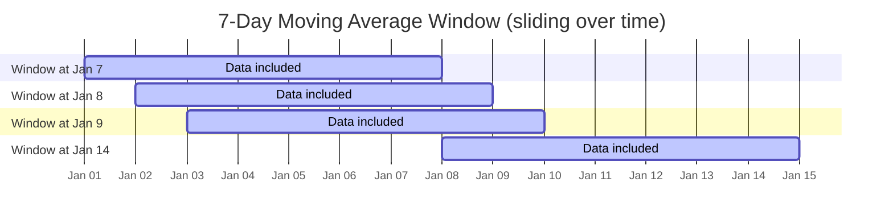
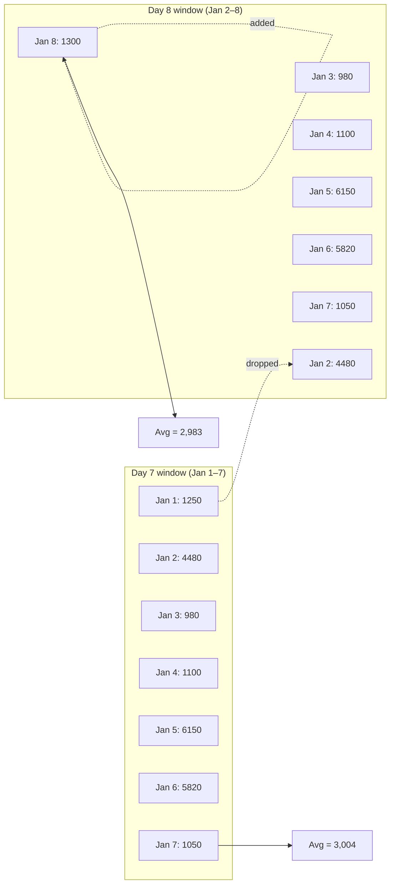
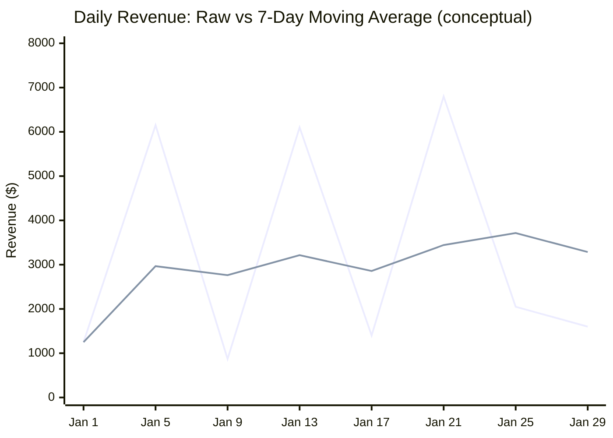
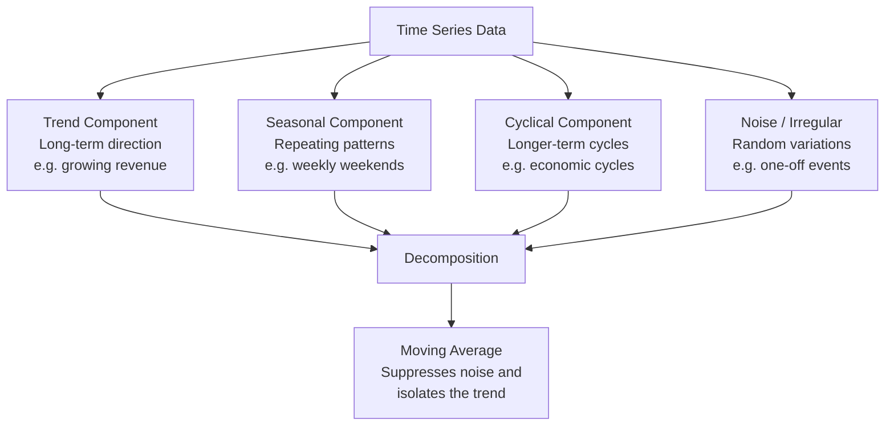

# Moving Average: Complete Practical Guide

> **Audience:** Beginner to Intermediate Data Analysts, BI Developers, Data Engineers, SQL Learners
> **Database:** PostgreSQL-compatible syntax
> **Difficulty:** ⭐⭐⭐ Intermediate

---

## Table of Contents

1. [Introduction](#1-introduction)
2. [Business Motivation](#2-business-motivation)
3. [Types of Moving Averages](#3-types-of-moving-averages)
4. [Mathematical Foundations](#4-mathematical-foundations)
5. [Sample Dataset](#5-sample-dataset)
6. [Visual Explanation](#6-visual-explanation)
7. [SQL Window Functions Refresher](#7-sql-window-functions-refresher)
8. [Building a 3-Day Moving Average](#8-building-a-3-day-moving-average)
9. [Building a 7-Day Moving Average](#9-building-a-7-day-moving-average)
10. [Building a 30-Day Moving Average](#10-building-a-30-day-moving-average)
11. [Moving Average by Product](#11-moving-average-by-product)
12. [Moving Average by Region](#12-moving-average-by-region)
13. [Weighted Moving Average in SQL](#13-weighted-moving-average-in-sql)
14. [Exponential Moving Average](#14-exponential-moving-average)
15. [Time-Series Analysis Concepts](#15-time-series-analysis-concepts)
16. [Performance Considerations](#16-performance-considerations)
17. [Common Mistakes](#17-common-mistakes)
18. [Real-World Use Cases](#18-real-world-use-cases)
19. [Interview Questions](#19-interview-questions)
20. [Practice Exercises](#20-practice-exercises)
21. [Solutions](#21-solutions)
22. [Summary Cheat Sheet](#22-summary-cheat-sheet)

---

## 1. Introduction

### What Is a Moving Average?

A **moving average** (also called a **rolling average** or **running mean**) is a statistical technique that calculates the average of a data series over a sliding time window. As new data points are added, the window "moves" forward, continuously recalculating the average over the most recent N observations.

Think of it as a *smoothing lens* that you slide across your time-series data:

> *"Instead of looking at today's value in isolation, look at the average of the last 7 days."*

In SQL, moving averages are implemented using **window functions** — specifically the `AVG()` function combined with `OVER()`, `ORDER BY`, and `ROWS BETWEEN` clauses.

```sql
-- 7-day simple moving average in SQL
SELECT
    sale_date,
    daily_sales,
    AVG(daily_sales) OVER (
        ORDER BY sale_date
        ROWS BETWEEN 6 PRECEDING AND CURRENT ROW
    ) AS sma_7day
FROM daily_sales_data;
```

### Why Businesses Use Moving Averages

| Business Goal | How Moving Average Helps |
|---|---|
| **Identify trends** | Smooths out short-term noise to reveal long-term direction |
| **Compare periods** | Makes week-over-week or month-over-month comparisons cleaner |
| **Detect seasonality** | Separates cyclical patterns from underlying trends |
| **Forecast future values** | Provides a baseline for projections |
| **Alert on anomalies** | Deviations from the moving average flag unusual activity |
| **Financial analysis** | The basis for trading signals (e.g., Golden Cross, Death Cross) |

---

## 2. Business Motivation

### The Problem: Noisy Data

Consider daily sales data for an online retailer over January 2024:

```
Date        | Daily Sales
------------|-------------
2024-01-01  |   1,200
2024-01-02  |   4,500   ← spike (promotion)
2024-01-03  |   980
2024-01-04  |   1,100
2024-01-05  |   6,200   ← spike (weekend)
2024-01-06  |   5,800   ← spike (weekend)
2024-01-07  |   1,050
2024-01-08  |   1,300
```

Looking at raw daily figures, it's hard to answer:
- *Is sales performance improving, declining, or flat?*
- *Was Tuesday's drop unusual or normal?*
- *What should we forecast for next week?*

### The Solution: Smoothing with Moving Average

```
Date        | Daily Sales | 7-Day MA
------------|-------------|----------
2024-01-07  |   1,050     |  3,118   (avg of days 1–7)
2024-01-08  |   1,300     |  3,133   (avg of days 2–8)
```

By averaging the last 7 days, the spikes from weekend promotions are absorbed, and the **underlying trend** becomes visible. A rising 7-day moving average tells you that — despite day-to-day volatility — the business is growing.

### Real-World Example: Stock Analysis

In financial markets, the **50-day** and **200-day** simple moving averages are fundamental indicators:
- When the 50-day crosses above the 200-day → **Golden Cross** (bullish signal)
- When the 50-day crosses below the 200-day → **Death Cross** (bearish signal)

The same logic applies to sales trends, website traffic, customer counts, and inventory levels.

---

## 3. Types of Moving Averages

### Simple Moving Average (SMA)

Every data point within the window contributes **equally** to the average.

**Formula:** `SMA = (x₁ + x₂ + ... + xₙ) / n`

- **Window:** Fixed size N
- **Sensitivity:** Reacts equally to old and new data
- **Lag:** High (slow to respond to recent changes)
- **Best for:** Long-term trend analysis, stable metrics

---

### Weighted Moving Average (WMA)

Data points are assigned **different weights**, typically giving more importance to recent observations.

**Formula:** `WMA = (w₁x₁ + w₂x₂ + ... + wₙxₙ) / (w₁ + w₂ + ... + wₙ)`

- **Window:** Fixed size N, with explicit weights
- **Sensitivity:** More responsive to recent values
- **Lag:** Medium
- **Best for:** Demand forecasting, inventory planning

---

### Exponential Moving Average (EMA)

Weights decrease **exponentially** for older data. There is no fixed window — all historical data contributes, but older values have negligible influence.

**Formula:** `EMAₜ = α × xₜ + (1 − α) × EMAt₋₁`
where `α` (smoothing factor) = `2 / (N + 1)`

- **Window:** Infinite lookback, exponentially decaying weights
- **Sensitivity:** Highest — reacts quickly to new information
- **Lag:** Lowest
- **Best for:** Trading signals, real-time monitoring, rapidly changing metrics

---

### Comparison Table

| Feature | SMA | WMA | EMA |
|---|---|---|---|
| **Calculation** | Equal average | Weighted average | Exponential decay |
| **Recency bias** | None | Medium | High |
| **Lag** | High | Medium | Low |
| **Complexity** | Simple | Moderate | Complex |
| **SQL difficulty** | Easy | Moderate | Advanced |
| **Memory requirement** | N rows | N rows | All history |
| **Outlier sensitivity** | Low | Medium | High |
| **Best use case** | Long-term trends | Demand forecasting | Trading, real-time |
| **Common window sizes** | 7, 30, 200 days | 5, 10, 20 days | N/A (uses α) |

---

## 4. Mathematical Foundations

### Simple Moving Average — Worked Example

Data: `[10, 20, 30, 40, 50, 60, 70]`
Window size: **3**

```
Position | Value | 3-Day SMA Calculation        | SMA Result
---------|-------|------------------------------|------------
1        |  10   | Not enough data              |  —
2        |  20   | Not enough data              |  —
3        |  30   | (10 + 20 + 30) / 3           |  20.00
4        |  40   | (20 + 30 + 40) / 3           |  30.00
5        |  50   | (30 + 40 + 50) / 3           |  40.00
6        |  60   | (40 + 50 + 60) / 3           |  50.00
7        |  70   | (50 + 60 + 70) / 3           |  60.00
```

Notice: The SMA **lags** behind the actual values. At position 7, the actual value is 70 but the SMA is 60.

---

### Weighted Moving Average — Worked Example

Data: `[10, 20, 30]`  
Weights: `[1, 2, 3]` (most recent gets the highest weight)

```
WMA = (1×10 + 2×20 + 3×30) / (1 + 2 + 3)
    = (10 + 40 + 90) / 6
    = 140 / 6
    = 23.33
```

Compare to SMA = `(10 + 20 + 30) / 3 = 20.00`

The WMA of `23.33` is closer to the most recent value `30`, reflecting the recency bias.

---

### Exponential Moving Average — Worked Example

Data: `[10, 20, 30, 40, 50]`
N = 3, so α = `2 / (3 + 1) = 0.5`

```
EMA₁ = 10                              (initialise with first value)
EMA₂ = 0.5 × 20 + (1 - 0.5) × 10 = 15.00
EMA₃ = 0.5 × 30 + (1 - 0.5) × 15 = 22.50
EMA₄ = 0.5 × 40 + (1 - 0.5) × 22.50 = 31.25
EMA₅ = 0.5 × 50 + (1 - 0.5) × 31.25 = 40.63
```

Compare: SMA₅ = `(30 + 40 + 50) / 3 = 40.00`

EMA = `40.63` is slightly higher because recent high values receive more weight.

---

## 5. Sample Dataset

### Table Definition

```sql
-- Daily sales table
CREATE TABLE daily_sales (
    sale_date        DATE           PRIMARY KEY,
    product          VARCHAR(50)    NOT NULL,
    region           VARCHAR(50)    NOT NULL,
    daily_revenue    NUMERIC(10, 2) NOT NULL,
    units_sold       INT            NOT NULL,
    new_customers    INT            NOT NULL
);
```

### Inserting 35 Days of Realistic Data

```sql
-- January–February 2024 daily sales data
INSERT INTO daily_sales (sale_date, product, region, daily_revenue, units_sold, new_customers)
VALUES
    -- Week 1 (moderate, building up)
    ('2024-01-01', 'Widget Pro', 'North', 1250.00,  42,  8),
    ('2024-01-02', 'Widget Pro', 'North', 4480.00, 151, 35),  -- promotion
    ('2024-01-03', 'Widget Pro', 'North',  980.00,  33,  5),
    ('2024-01-04', 'Widget Pro', 'North', 1100.00,  37,  7),
    ('2024-01-05', 'Widget Pro', 'North', 6150.00, 207, 52),  -- weekend spike
    ('2024-01-06', 'Widget Pro', 'North', 5820.00, 196, 48),  -- weekend spike
    ('2024-01-07', 'Widget Pro', 'North', 1050.00,  35,  6),

    -- Week 2 (slight growth, one dip)
    ('2024-01-08', 'Widget Pro', 'North', 1300.00,  44,  9),
    ('2024-01-09', 'Widget Pro', 'North', 1450.00,  49, 11),
    ('2024-01-10', 'Widget Pro', 'North',  870.00,  29,  3),  -- mid-week dip
    ('2024-01-11', 'Widget Pro', 'North', 1200.00,  40,  8),
    ('2024-01-12', 'Widget Pro', 'North', 6400.00, 215, 56),  -- weekend
    ('2024-01-13', 'Widget Pro', 'North', 6100.00, 205, 54),  -- weekend
    ('2024-01-14', 'Widget Pro', 'North', 1150.00,  39,  7),

    -- Week 3 (growing trend)
    ('2024-01-15', 'Widget Pro', 'North', 1500.00,  51, 12),
    ('2024-01-16', 'Widget Pro', 'North', 1650.00,  56, 14),
    ('2024-01-17', 'Widget Pro', 'North', 1400.00,  47, 10),
    ('2024-01-18', 'Widget Pro', 'North', 1700.00,  57, 15),
    ('2024-01-19', 'Widget Pro', 'North', 7100.00, 239, 63),  -- weekend
    ('2024-01-20', 'Widget Pro', 'North', 6800.00, 229, 60),  -- weekend
    ('2024-01-21', 'Widget Pro', 'North', 1600.00,  54, 13),

    -- Week 4 (peak, then correction)
    ('2024-01-22', 'Widget Pro', 'North', 1800.00,  61, 17),
    ('2024-01-23', 'Widget Pro', 'North', 1950.00,  66, 19),
    ('2024-01-24', 'Widget Pro', 'North', 2100.00,  71, 22),
    ('2024-01-25', 'Widget Pro', 'North', 2050.00,  69, 21),
    ('2024-01-26', 'Widget Pro', 'North', 7800.00, 263, 72),  -- weekend
    ('2024-01-27', 'Widget Pro', 'North', 7500.00, 253, 69),  -- weekend
    ('2024-01-28', 'Widget Pro', 'North', 1750.00,  59, 16),

    -- Week 5 (correction, seasonal dip)
    ('2024-01-29', 'Widget Pro', 'North', 1600.00,  54, 13),
    ('2024-01-30', 'Widget Pro', 'North', 1400.00,  47, 10),
    ('2024-01-31', 'Widget Pro', 'North', 1500.00,  51, 12),
    ('2024-02-01', 'Widget Pro', 'North', 1450.00,  49, 11),
    ('2024-02-02', 'Widget Pro', 'North', 6900.00, 232, 64),  -- weekend
    ('2024-02-03', 'Widget Pro', 'North', 6600.00, 222, 61),  -- weekend
    ('2024-02-04', 'Widget Pro', 'North', 1550.00,  52, 12);
```

### Data Characteristics

| Property | Value |
|---|---|
| Date range | 2024-01-01 to 2024-02-04 (35 days) |
| Product | Widget Pro |
| Region | North |
| Weekend pattern | ~4–5× higher than weekdays |
| Promotion spike | 2024-01-02 |
| Trend | Gradual weekday growth Jan 15 to Jan 28 |

---

## 6. Visual Explanation

### The Moving Window Concept



### How the Window Moves Row by Row



### Raw vs Smoothed Data Concept



---

## 7. SQL Window Functions Refresher

### The OVER() Clause

A **window function** performs a calculation across a set of rows *related to the current row*, without collapsing them into a single output row (unlike `GROUP BY`).

```sql
AVG(daily_revenue) OVER (
    PARTITION BY product          -- define separate windows per group
    ORDER BY sale_date            -- define the ordering within the window
    ROWS BETWEEN 6 PRECEDING      -- window frame start
             AND CURRENT ROW      -- window frame end
)
```

### Component Reference

#### PARTITION BY

Divides the result set into independent partitions. The window function resets for each partition.

```sql
-- Separate moving average per product
AVG(daily_revenue) OVER (
    PARTITION BY product
    ORDER BY sale_date
    ROWS BETWEEN 6 PRECEDING AND CURRENT ROW
)
```

#### ORDER BY (inside OVER)

Defines the logical ordering of rows within each partition. For time-series, this is almost always a date/timestamp column.

```sql
-- Order by date ascending (most common for time-series)
ORDER BY sale_date ASC
```

#### ROWS BETWEEN — Frame Specification

The `ROWS BETWEEN` clause defines the exact window frame.

| Expression | Meaning |
|---|---|
| `UNBOUNDED PRECEDING` | From the very first row of the partition |
| `N PRECEDING` | N rows before the current row |
| `CURRENT ROW` | The current row itself |
| `N FOLLOWING` | N rows after the current row |
| `UNBOUNDED FOLLOWING` | To the very last row of the partition |

**Common Frame Patterns:**

```sql
-- Cumulative sum (from beginning to current row)
ROWS BETWEEN UNBOUNDED PRECEDING AND CURRENT ROW

-- Last 7 days (including today)
ROWS BETWEEN 6 PRECEDING AND CURRENT ROW

-- Centred 5-day window (2 before, current, 2 after)
ROWS BETWEEN 2 PRECEDING AND 2 FOLLOWING

-- Trailing 30-day average
ROWS BETWEEN 29 PRECEDING AND CURRENT ROW
```

#### RANGE vs ROWS

```sql
-- ROWS: Physical row count — precise, most commonly used
ROWS BETWEEN 6 PRECEDING AND CURRENT ROW

-- RANGE: Logical value range — groups rows with equal ORDER BY values
RANGE BETWEEN INTERVAL '6 days' PRECEDING AND CURRENT ROW
-- Useful when data may have gaps (missing dates) — RANGE fills correctly
```

> 💡 **Best Practice:** Use `ROWS BETWEEN` for most moving average calculations. Use `RANGE BETWEEN` with an interval when your data may have date gaps and you want the window to always cover a calendar period.

---

## 8. Building a 3-Day Moving Average

### Step 1: Understand the Goal

A 3-day SMA at day `t` = average of `t-2`, `t-1`, and `t`.

Frame: `ROWS BETWEEN 2 PRECEDING AND CURRENT ROW`

### Step 2: Write the Query

```sql
SELECT
    sale_date,
    daily_revenue,
    ROUND(
        AVG(daily_revenue) OVER (
            ORDER BY sale_date
            ROWS BETWEEN 2 PRECEDING AND CURRENT ROW
        ),
    2) AS sma_3day,
    COUNT(*) OVER (
        ORDER BY sale_date
        ROWS BETWEEN 2 PRECEDING AND CURRENT ROW
    )    AS rows_in_window   -- useful for debugging
FROM daily_sales
WHERE product = 'Widget Pro' AND region = 'North'
ORDER BY sale_date;
```

### Step 3: Understand the Output

```
 sale_date  | daily_revenue | sma_3day | rows_in_window
------------+---------------+----------+----------------
 2024-01-01 |    1250.00    | 1250.00  |       1        ← only 1 row available
 2024-01-02 |    4480.00    | 2865.00  |       2        ← only 2 rows available
 2024-01-03 |     980.00    | 2236.67  |       3        ← full 3-row window
 2024-01-04 |    1100.00    | 2186.67  |       3
 2024-01-05 |    6150.00    | 2743.33  |       3
 2024-01-06 |    5820.00    | 4356.67  |       3
 2024-01-07 |    1050.00    | 4340.00  |       3
 2024-01-08 |    1300.00    | 2723.33  |       3
```

> ⚠️ **Partial Windows:** Notice that rows 1 and 2 have fewer than 3 values in their window. SQL's default behaviour is to compute the average over whatever rows are available. This is called a **partial window**. Some analysts prefer to exclude these partial results — see the Common Mistakes section for how.

### Step 4: Verify Manually

For `2024-01-03`: `(1250 + 4480 + 980) / 3 = 6710 / 3 = 2236.67` ✅

---

## 9. Building a 7-Day Moving Average

The 7-day moving average is one of the most common smoothing windows in business analytics. It's particularly effective because it covers an entire week, neutralising the weekday/weekend effect.

### Query

```sql
SELECT
    sale_date,
    daily_revenue,
    ROUND(
        AVG(daily_revenue) OVER (
            ORDER BY sale_date
            ROWS BETWEEN 6 PRECEDING AND CURRENT ROW
        ),
    2) AS sma_7day
FROM daily_sales
WHERE product = 'Widget Pro' AND region = 'North'
ORDER BY sale_date;
```

### Output (Selected Rows)

```
 sale_date  | daily_revenue | sma_7day
------------+---------------+----------
 2024-01-01 |    1250.00    |  1250.00   ← partial window
 2024-01-02 |    4480.00    |  2865.00   ← partial window
 2024-01-03 |     980.00    |  2236.67   ← partial window
 2024-01-04 |    1100.00    |  1952.50   ← partial window
 2024-01-05 |    6150.00    |  2792.00   ← partial window
 2024-01-06 |    5820.00    |  3296.67   ← partial window
 2024-01-07 |    1050.00    |  2975.71   ← FULL 7-day window starts here
 2024-01-08 |    1300.00    |  3011.43
 2024-01-09 |    1450.00    |  2535.71
 2024-01-14 |    1150.00    |  3228.57
 2024-01-21 |    1600.00    |  3342.86
 2024-01-28 |    1750.00    |  3564.29
```

### Excluding Partial Windows

```sql
-- Show only full 7-day windows
SELECT
    sale_date,
    daily_revenue,
    sma_7day
FROM (
    SELECT
        sale_date,
        daily_revenue,
        ROUND(AVG(daily_revenue) OVER (
            ORDER BY sale_date
            ROWS BETWEEN 6 PRECEDING AND CURRENT ROW
        ), 2) AS sma_7day,
        ROW_NUMBER() OVER (ORDER BY sale_date) AS rn
    FROM daily_sales
    WHERE product = 'Widget Pro' AND region = 'North'
) sub
WHERE rn >= 7   -- only show rows with a full 7-day window available
ORDER BY sale_date;
```

---

## 10. Building a 30-Day Moving Average

The 30-day moving average reveals the **monthly trend** and is used in executive dashboards, investor reporting, and long-range forecasting.

### Query

```sql
SELECT
    sale_date,
    daily_revenue,
    ROUND(
        AVG(daily_revenue) OVER (
            ORDER BY sale_date
            ROWS BETWEEN 29 PRECEDING AND CURRENT ROW
        ),
    2) AS sma_30day,
    -- Compare today vs the 30-day trend
    ROUND(
        daily_revenue - AVG(daily_revenue) OVER (
            ORDER BY sale_date
            ROWS BETWEEN 29 PRECEDING AND CURRENT ROW
        ),
    2) AS deviation_from_trend
FROM daily_sales
WHERE product = 'Widget Pro' AND region = 'North'
ORDER BY sale_date;
```

### Interpreting Deviations

```
 sale_date  | daily_revenue | sma_30day | deviation_from_trend
------------+---------------+-----------+---------------------
 2024-01-30 |    1400.00    |  2988.00  |     -1588.00        ← below average
 2024-01-31 |    1500.00    |  2979.00  |     -1479.00        ← below average
 2024-02-01 |    1450.00    |  2970.00  |     -1520.00        ← below average
 2024-02-02 |    6900.00    |  2997.00  |     +3903.00        ← above average (weekend)
 2024-02-03 |    6600.00    |  3021.00  |     +3579.00        ← above average (weekend)
```

> 💡 **Insight:** Weekday revenues (`1400–1550`) are consistently below the 30-day average, while weekends (`6600–6900`) are well above it. This confirms the weekly seasonality pattern — a critical insight for staffing and inventory decisions.

---

## 11. Moving Average by Product

### Scenario

Your company sells three products. You need a per-product 7-day moving average to compare their individual trends.

### Dataset Extension

```sql
-- Add more products for multi-product analysis
INSERT INTO daily_sales (sale_date, product, region, daily_revenue, units_sold, new_customers)
VALUES
    ('2024-01-01', 'Gadget Lite', 'North',  850.00, 65, 12),
    ('2024-01-02', 'Gadget Lite', 'North', 2900.00, 222, 38),
    ('2024-01-03', 'Gadget Lite', 'North',  720.00, 55,  7),
    ('2024-01-04', 'Gadget Lite', 'North',  790.00, 61,  9),
    ('2024-01-05', 'Gadget Lite', 'North', 3800.00, 292, 52),
    ('2024-01-06', 'Gadget Lite', 'North', 3600.00, 277, 48),
    ('2024-01-07', 'Gadget Lite', 'North',  780.00, 60,  8),
    ('2024-01-08', 'Gadget Lite', 'North',  900.00, 69, 11),
    ('2024-01-09', 'Gadget Lite', 'North',  950.00, 73, 13),
    ('2024-01-10', 'Gadget Lite', 'North',  680.00, 52,  5);
```

### Per-Product 7-Day Moving Average Query

```sql
SELECT
    sale_date,
    product,
    daily_revenue,
    ROUND(
        AVG(daily_revenue) OVER (
            PARTITION BY product             -- ← separate window per product
            ORDER BY sale_date
            ROWS BETWEEN 6 PRECEDING AND CURRENT ROW
        ),
    2) AS sma_7day_by_product
FROM daily_sales
WHERE region = 'North'
ORDER BY product, sale_date;
```

### Key Point: PARTITION BY

Without `PARTITION BY product`, the moving average would blur data across products, producing meaningless averages. With it, each product gets its own independent sliding window — as if you ran the query separately for each product.

```
 sale_date  | product     | daily_revenue | sma_7day_by_product
------------+-------------+---------------+---------------------
 2024-01-01 | Gadget Lite |    850.00     |       850.00
 2024-01-02 | Gadget Lite |   2900.00     |      1875.00
 ...
 2024-01-07 | Gadget Lite |    780.00     |      1805.71   ← 7-day avg for Gadget Lite
 2024-01-01 | Widget Pro  |   1250.00     |      1250.00
 2024-01-02 | Widget Pro  |   4480.00     |      2865.00
 ...
 2024-01-07 | Widget Pro  |   1050.00     |      2975.71   ← 7-day avg for Widget Pro
```

---

## 12. Moving Average by Region

### Scenario

You have sales data across multiple regions and need to track trends independently per region.

### Multi-Region Dataset

```sql
-- Add South region data
INSERT INTO daily_sales (sale_date, product, region, daily_revenue, units_sold, new_customers)
VALUES
    ('2024-01-01', 'Widget Pro', 'South',  980.00,  33,  6),
    ('2024-01-02', 'Widget Pro', 'South', 3500.00, 118, 28),
    ('2024-01-03', 'Widget Pro', 'South',  850.00,  29,  4),
    ('2024-01-04', 'Widget Pro', 'South',  920.00,  31,  5),
    ('2024-01-05', 'Widget Pro', 'South', 5100.00, 172, 43),
    ('2024-01-06', 'Widget Pro', 'South', 4900.00, 165, 41),
    ('2024-01-07', 'Widget Pro', 'South',  890.00,  30,  5);
```

### Per-Region Moving Average

```sql
SELECT
    sale_date,
    region,
    product,
    daily_revenue,
    ROUND(
        AVG(daily_revenue) OVER (
            PARTITION BY region, product          -- partition by BOTH region and product
            ORDER BY sale_date
            ROWS BETWEEN 6 PRECEDING AND CURRENT ROW
        ),
    2) AS sma_7day
FROM daily_sales
ORDER BY region, product, sale_date;
```

### Comparing Regions Side by Side

```sql
-- Pivot-style comparison: North vs South 7-day moving averages
SELECT
    sale_date,
    ROUND(
        AVG(CASE WHEN region = 'North' THEN daily_revenue END)
            OVER (ORDER BY sale_date ROWS BETWEEN 6 PRECEDING AND CURRENT ROW),
    2) AS north_sma_7day,
    ROUND(
        AVG(CASE WHEN region = 'South' THEN daily_revenue END)
            OVER (ORDER BY sale_date ROWS BETWEEN 6 PRECEDING AND CURRENT ROW),
    2) AS south_sma_7day
FROM daily_sales
WHERE product = 'Widget Pro'
GROUP BY sale_date
ORDER BY sale_date;
```

---

## 13. Weighted Moving Average in SQL

### Concept Recap

In a 3-day WMA with weights `[1, 2, 3]`:
- The oldest day gets weight 1
- The middle day gets weight 2
- The most recent day gets weight 3

### Implementation Using CASE WHEN

```sql
-- 3-day Weighted Moving Average
SELECT
    sale_date,
    daily_revenue,
    ROUND(
        (
            1 * LAG(daily_revenue, 2, NULL) OVER (ORDER BY sale_date) +
            2 * LAG(daily_revenue, 1, NULL) OVER (ORDER BY sale_date) +
            3 * daily_revenue
        )
        / NULLIF(
            (CASE WHEN LAG(daily_revenue, 2) OVER (ORDER BY sale_date) IS NOT NULL THEN 1 ELSE 0 END +
             CASE WHEN LAG(daily_revenue, 1) OVER (ORDER BY sale_date) IS NOT NULL THEN 2 ELSE 0 END +
             3),
        0),
    2) AS wma_3day
FROM daily_sales
WHERE product = 'Widget Pro' AND region = 'North'
ORDER BY sale_date;
```

### Cleaner Implementation Using CTEs

```sql
-- Weighted Moving Average — cleaner approach using CTEs
WITH indexed AS (
    SELECT
        sale_date,
        daily_revenue,
        ROW_NUMBER() OVER (ORDER BY sale_date) AS rn
    FROM daily_sales
    WHERE product = 'Widget Pro' AND region = 'North'
),
weighted AS (
    SELECT
        curr.sale_date,
        curr.daily_revenue,
        curr.rn,
        -- Weight 3 for current, 2 for previous, 1 for two days ago
        CASE WHEN curr.rn >= 3 THEN
            (1 * prev2.daily_revenue +
             2 * prev1.daily_revenue +
             3 * curr.daily_revenue) / 6.0
        END AS wma_3day_weighted
    FROM indexed curr
    LEFT JOIN indexed prev1 ON prev1.rn = curr.rn - 1
    LEFT JOIN indexed prev2 ON prev2.rn = curr.rn - 2
)
SELECT
    sale_date,
    daily_revenue,
    ROUND(wma_3day_weighted, 2) AS wma_3day
FROM weighted
ORDER BY sale_date;
```

### 5-Day WMA with Linear Weights

```sql
-- 5-day WMA using weights 1, 2, 3, 4, 5
WITH lagged AS (
    SELECT
        sale_date,
        daily_revenue,
        LAG(daily_revenue, 4) OVER (ORDER BY sale_date) AS d_minus_4,
        LAG(daily_revenue, 3) OVER (ORDER BY sale_date) AS d_minus_3,
        LAG(daily_revenue, 2) OVER (ORDER BY sale_date) AS d_minus_2,
        LAG(daily_revenue, 1) OVER (ORDER BY sale_date) AS d_minus_1
    FROM daily_sales
    WHERE product = 'Widget Pro' AND region = 'North'
)
SELECT
    sale_date,
    daily_revenue,
    ROUND(
        (1 * d_minus_4 + 2 * d_minus_3 + 3 * d_minus_2 + 4 * d_minus_1 + 5 * daily_revenue)
        / 15.0,   -- sum of weights: 1+2+3+4+5 = 15
    2) AS wma_5day
FROM lagged
WHERE d_minus_4 IS NOT NULL   -- only show full windows
ORDER BY sale_date;
```

> 💡 **Weight sum denominator:** For linear weights 1 through N, the sum = `N * (N + 1) / 2`. For N=5: `5 * 6 / 2 = 15`.

---

## 14. Exponential Moving Average

### Why EMA Is Different

Unlike SMA and WMA which require a fixed window, EMA processes data **sequentially** — each new EMA value depends on the previous one. This makes pure SQL implementations challenging because SQL processes rows in sets, not sequences.

### Conceptual SQL Approximation

**Option 1: Recursive CTE (for small datasets)**

```sql
-- EMA using recursive CTE (N=7, α = 2/(7+1) = 0.25)
WITH RECURSIVE ema_calc AS (
    -- Anchor: first row
    SELECT
        sale_date,
        daily_revenue,
        daily_revenue::NUMERIC AS ema_value,
        1 AS row_num
    FROM (
        SELECT sale_date, daily_revenue,
               ROW_NUMBER() OVER (ORDER BY sale_date) AS rn
        FROM daily_sales
        WHERE product = 'Widget Pro' AND region = 'North'
    ) t WHERE rn = 1

    UNION ALL

    -- Recursive step: apply EMA formula
    SELECT
        nxt.sale_date,
        nxt.daily_revenue,
        ROUND(
            0.25 * nxt.daily_revenue + 0.75 * prev.ema_value,  -- α=0.25
        2),
        prev.row_num + 1
    FROM ema_calc prev
    JOIN (
        SELECT sale_date, daily_revenue,
               ROW_NUMBER() OVER (ORDER BY sale_date) AS rn
        FROM daily_sales
        WHERE product = 'Widget Pro' AND region = 'North'
    ) nxt ON nxt.rn = prev.row_num + 1
)
SELECT sale_date, daily_revenue, ema_value AS ema_7day
FROM ema_calc
ORDER BY sale_date;
```

> ⚠️ **Performance Warning:** Recursive CTEs process one row at a time and are slow on large datasets. For production EMA on millions of rows, consider Python/Pandas, a stored procedure, or a platform like Snowflake with native EMA support.

**Option 2: SQL Approximation Using Exponentially Decaying Weights**

```sql
-- EMA approximation: use explicit exponentially decaying weights
-- This is an N-term approximation, not infinite-history EMA
-- α = 0.3 → weights: 0.3, 0.21, 0.147, 0.103, 0.072, 0.05, 0.035, ...
WITH lagged AS (
    SELECT
        sale_date,
        daily_revenue,
        LAG(daily_revenue, 1) OVER (ORDER BY sale_date) AS d1,
        LAG(daily_revenue, 2) OVER (ORDER BY sale_date) AS d2,
        LAG(daily_revenue, 3) OVER (ORDER BY sale_date) AS d3,
        LAG(daily_revenue, 4) OVER (ORDER BY sale_date) AS d4,
        LAG(daily_revenue, 5) OVER (ORDER BY sale_date) AS d5,
        LAG(daily_revenue, 6) OVER (ORDER BY sale_date) AS d6
    FROM daily_sales
    WHERE product = 'Widget Pro' AND region = 'North'
)
SELECT
    sale_date,
    daily_revenue,
    ROUND(
        (0.300 * daily_revenue +
         0.210 * COALESCE(d1, daily_revenue) +
         0.147 * COALESCE(d2, daily_revenue) +
         0.103 * COALESCE(d3, daily_revenue) +
         0.072 * COALESCE(d4, daily_revenue) +
         0.050 * COALESCE(d5, daily_revenue) +
         0.035 * COALESCE(d6, daily_revenue))
        / (0.300 + 0.210 + 0.147 + 0.103 + 0.072 + 0.050 + 0.035),
    2) AS ema_approx
FROM lagged
ORDER BY sale_date;
```

---

## 15. Time-Series Analysis Concepts

### The Four Components of a Time Series



### Trend

The **long-term direction** of a metric. A rising 30-day moving average indicates a positive trend regardless of daily fluctuations.

```sql
-- Identify upward trend: today's 30-day MA > last week's 30-day MA
SELECT
    sale_date,
    sma_30day,
    LAG(sma_30day, 7) OVER (ORDER BY sale_date) AS sma_30day_week_ago,
    CASE
        WHEN sma_30day > LAG(sma_30day, 7) OVER (ORDER BY sale_date)
        THEN '↑ Uptrend'
        WHEN sma_30day < LAG(sma_30day, 7) OVER (ORDER BY sale_date)
        THEN '↓ Downtrend'
        ELSE '→ Flat'
    END AS trend_signal
FROM (
    SELECT
        sale_date,
        ROUND(AVG(daily_revenue) OVER (
            ORDER BY sale_date ROWS BETWEEN 29 PRECEDING AND CURRENT ROW
        ), 2) AS sma_30day
    FROM daily_sales
    WHERE product = 'Widget Pro' AND region = 'North'
) t
ORDER BY sale_date;
```

### Seasonality

**Repeating patterns** at regular intervals — daily, weekly, monthly, or annually.

```sql
-- Detect weekly seasonality: compare each day to same day last week
SELECT
    sale_date,
    EXTRACT(DOW FROM sale_date)          AS day_of_week,  -- 0=Sunday
    daily_revenue,
    LAG(daily_revenue, 7) OVER (ORDER BY sale_date) AS same_day_last_week,
    ROUND(
        (daily_revenue - LAG(daily_revenue, 7) OVER (ORDER BY sale_date))
        * 100.0
        / NULLIF(LAG(daily_revenue, 7) OVER (ORDER BY sale_date), 0),
    1)                                   AS wow_pct_change
FROM daily_sales
WHERE product = 'Widget Pro' AND region = 'North'
ORDER BY sale_date;
```

### Noise Reduction

Moving averages are fundamentally **low-pass filters** — they allow slow-moving trends through while filtering out high-frequency noise.

```sql
-- Quantify noise: how much does each day deviate from its 7-day MA?
SELECT
    sale_date,
    daily_revenue,
    sma_7day,
    daily_revenue - sma_7day              AS absolute_deviation,
    ROUND(
        ABS(daily_revenue - sma_7day) * 100.0 / NULLIF(sma_7day, 0),
    1)                                    AS pct_deviation
FROM (
    SELECT
        sale_date,
        daily_revenue,
        ROUND(AVG(daily_revenue) OVER (
            ORDER BY sale_date ROWS BETWEEN 6 PRECEDING AND CURRENT ROW
        ), 2) AS sma_7day
    FROM daily_sales
    WHERE product = 'Widget Pro' AND region = 'North'
) t
ORDER BY ABS(daily_revenue - sma_7day) DESC;  -- sort by biggest outliers
```

### Smoothing Factor Selection Guide

| Business Scenario | Recommended MA | Window Size |
|---|---|---|
| Day-to-day operational monitoring | SMA | 3–5 days |
| Weekly trend analysis | SMA | 7 days |
| Monthly executive reporting | SMA | 30 days |
| Stock technical analysis | SMA / EMA | 50 / 200 days |
| Demand forecasting | WMA | 4–8 weeks |
| Real-time anomaly detection | EMA | α = 0.2–0.4 |

---

## 16. Performance Considerations

### Window Function Execution Model

Window functions are computed **after** `WHERE` and `GROUP BY` but **before** `SELECT` projection and `ORDER BY`. This has important implications:


### Indexing for Moving Average Queries

```sql
-- Essential: index on the columns used in ORDER BY and PARTITION BY
CREATE INDEX idx_daily_sales_product_date
    ON daily_sales (product, region, sale_date);

-- Covering index: also includes the aggregate column
CREATE INDEX idx_daily_sales_covering
    ON daily_sales (product, region, sale_date)
    INCLUDE (daily_revenue);
```

> 💡 **Why this matters:** The window function's `ORDER BY sale_date` inside `OVER()` must sort rows to establish their order within the window. An index that already has data sorted by `(product, region, sale_date)` allows the engine to skip an explicit sort step, significantly speeding up queries on large tables.

### Partitioning for Large Time-Series Tables

```sql
-- Partition a large sales table by month
CREATE TABLE daily_sales_partitioned (
    sale_date     DATE           NOT NULL,
    product       VARCHAR(50)    NOT NULL,
    region        VARCHAR(50)    NOT NULL,
    daily_revenue NUMERIC(10, 2) NOT NULL
) PARTITION BY RANGE (sale_date);

-- Create monthly partitions
CREATE TABLE daily_sales_2024_01 PARTITION OF daily_sales_partitioned
    FOR VALUES FROM ('2024-01-01') TO ('2024-02-01');

CREATE TABLE daily_sales_2024_02 PARTITION OF daily_sales_partitioned
    FOR VALUES FROM ('2024-02-01') TO ('2024-03-01');
```

### Reducing Memory Pressure

```sql
-- ✅ Filter BEFORE computing moving average (reduces rows in window computation)
WITH filtered AS (
    SELECT sale_date, daily_revenue
    FROM daily_sales
    WHERE product    = 'Widget Pro'
      AND region     = 'North'
      AND sale_date  >= '2024-01-01'   -- filter early
)
SELECT
    sale_date,
    daily_revenue,
    AVG(daily_revenue) OVER (
        ORDER BY sale_date
        ROWS BETWEEN 6 PRECEDING AND CURRENT ROW
    ) AS sma_7day
FROM filtered
ORDER BY sale_date;
```

### Materialised Views for Frequently Accessed Moving Averages

```sql
-- Pre-compute 7-day and 30-day moving averages nightly
CREATE MATERIALISED VIEW mv_sales_moving_avg AS
SELECT
    sale_date,
    product,
    region,
    daily_revenue,
    ROUND(AVG(daily_revenue) OVER (
        PARTITION BY product, region
        ORDER BY sale_date
        ROWS BETWEEN 6 PRECEDING AND CURRENT ROW
    ), 2) AS sma_7day,
    ROUND(AVG(daily_revenue) OVER (
        PARTITION BY product, region
        ORDER BY sale_date
        ROWS BETWEEN 29 PRECEDING AND CURRENT ROW
    ), 2) AS sma_30day
FROM daily_sales
WITH DATA;

CREATE INDEX ON mv_sales_moving_avg (product, region, sale_date);

-- Refresh nightly (at off-peak time)
REFRESH MATERIALISED VIEW CONCURRENTLY mv_sales_moving_avg;
```

---

## 17. Common Mistakes

### Mistake 1: Wrong Frame Size

```sql
-- ❌ Wrong: 7-day SMA using ROWS BETWEEN 7 PRECEDING
-- This actually creates an 8-row window (7 before + current = 8 rows)
ROWS BETWEEN 7 PRECEDING AND CURRENT ROW   -- 8 rows!

-- ✅ Correct: 7-day SMA = 6 preceding rows + current row
ROWS BETWEEN 6 PRECEDING AND CURRENT ROW   -- 7 rows ✓
```

**Rule of thumb:** For an N-day window, use `(N-1) PRECEDING`.

---

### Mistake 2: Forgetting PARTITION BY in Multi-Entity Analysis

```sql
-- ❌ Wrong: No PARTITION BY — window spans ALL products
SELECT product, sale_date, daily_revenue,
    AVG(daily_revenue) OVER (
        ORDER BY sale_date
        ROWS BETWEEN 6 PRECEDING AND CURRENT ROW
    ) AS sma_wrong
FROM daily_sales;
-- The last 7 rows may span multiple products — meaningless average!

-- ✅ Correct: PARTITION BY ensures independent windows per product
SELECT product, sale_date, daily_revenue,
    AVG(daily_revenue) OVER (
        PARTITION BY product, region
        ORDER BY sale_date
        ROWS BETWEEN 6 PRECEDING AND CURRENT ROW
    ) AS sma_correct
FROM daily_sales;
```

---

### Mistake 3: Ignoring Missing Dates (Gaps in Data)

```sql
-- ❌ Problem: If Jan 10 data is missing, ROWS BETWEEN 6 PRECEDING still
-- looks at 7 physical rows, but they may span 8+ calendar days
ROWS BETWEEN 6 PRECEDING AND CURRENT ROW

-- ✅ Solution for gap-sensitive windows: use RANGE BETWEEN with interval
RANGE BETWEEN INTERVAL '6 days' PRECEDING AND CURRENT ROW
-- This ensures exactly the past 6 calendar days, regardless of gaps
```

**Or fill gaps first:**
```sql
-- Generate all dates and LEFT JOIN to fill gaps with 0 or NULL
WITH calendar AS (
    SELECT generate_series(
        '2024-01-01'::DATE,
        '2024-02-04'::DATE,
        '1 day'::INTERVAL
    )::DATE AS sale_date
)
SELECT
    c.sale_date,
    COALESCE(d.daily_revenue, 0) AS daily_revenue
FROM calendar c
LEFT JOIN daily_sales d ON c.sale_date = d.sale_date
    AND d.product = 'Widget Pro' AND d.region = 'North'
ORDER BY c.sale_date;
```

---

### Mistake 4: Including Partial Windows Without Flagging Them

```sql
-- ❌ Misleading: Early rows show MA of 1 or 2 values — not a true 7-day MA
SELECT sale_date, AVG(daily_revenue) OVER (
    ORDER BY sale_date ROWS BETWEEN 6 PRECEDING AND CURRENT ROW
) AS sma_7day
FROM daily_sales;
-- Row 1's "7-day MA" is just row 1's value — extremely misleading!

-- ✅ Better: Flag partial windows explicitly
SELECT
    sale_date,
    daily_revenue,
    ROUND(AVG(daily_revenue) OVER (
        ORDER BY sale_date ROWS BETWEEN 6 PRECEDING AND CURRENT ROW
    ), 2)                                                           AS sma_7day,
    COUNT(*)   OVER (
        ORDER BY sale_date ROWS BETWEEN 6 PRECEDING AND CURRENT ROW
    )                                                               AS window_size,
    CASE WHEN COUNT(*) OVER (
        ORDER BY sale_date ROWS BETWEEN 6 PRECEDING AND CURRENT ROW
    ) < 7 THEN 'Partial' ELSE 'Full' END                           AS window_status
FROM daily_sales
WHERE product = 'Widget Pro' AND region = 'North';
```

---

### Mistake 5: Using the Wrong ORDER BY (DESC instead of ASC)

```sql
-- ❌ Wrong: Descending order means "future" rows are included in the window
SELECT sale_date, AVG(daily_revenue) OVER (
    ORDER BY sale_date DESC    -- ← WRONG for historical MA!
    ROWS BETWEEN 6 PRECEDING AND CURRENT ROW
) FROM daily_sales;

-- ✅ Correct: Always ascending for historical moving averages
SELECT sale_date, AVG(daily_revenue) OVER (
    ORDER BY sale_date ASC
    ROWS BETWEEN 6 PRECEDING AND CURRENT ROW
) FROM daily_sales;
```

---

### Mistake 6: Computing MA on Already-Aggregated Data at Wrong Granularity

```sql
-- ❌ Wrong: Computing 7-day MA on monthly aggregates
-- A 7-month MA is NOT the same as a 7-day MA on the underlying daily data
SELECT
    month,
    monthly_revenue,
    AVG(monthly_revenue) OVER (ORDER BY month ROWS BETWEEN 6 PRECEDING AND CURRENT ROW)
FROM monthly_summary;
-- This is a 7-MONTH MA, not 7-day!

-- ✅ Always work at the correct time granularity
-- For a 7-day MA, your base data must be at daily granularity
```

---

### Mistake 7: Dividing by Wrong Denominator in WMA

```sql
-- ❌ Wrong: dividing by 3 instead of 6 (sum of weights 1+2+3)
(1 * d_minus_2 + 2 * d_minus_1 + 3 * current_day) / 3

-- ✅ Correct: divide by the sum of all weights
(1 * d_minus_2 + 2 * d_minus_1 + 3 * current_day) / (1 + 2 + 3)   -- = /6
```

---

### Mistake 8: Using AVG() Without ROWS BETWEEN (Default Framing)

```sql
-- ❌ Potentially wrong: no ROWS BETWEEN clause
AVG(daily_revenue) OVER (ORDER BY sale_date)
-- Default frame is: RANGE BETWEEN UNBOUNDED PRECEDING AND CURRENT ROW
-- This produces a CUMULATIVE average, not a moving average!

-- ✅ Always specify ROWS BETWEEN explicitly for moving averages
AVG(daily_revenue) OVER (
    ORDER BY sale_date
    ROWS BETWEEN 6 PRECEDING AND CURRENT ROW
)
```

---

### Mistake 9: Filtering Out Partial Rows With a Hard WHERE Clause

```sql
-- ❌ Overly aggressive: filtering removes the first 6 rows entirely
WHERE ROW_NUMBER() OVER (ORDER BY sale_date) >= 7
-- But ROW_NUMBER() can't be used in WHERE directly — this errors!

-- ✅ Correct approach: wrap in a subquery or CTE
WITH ma AS (
    SELECT
        sale_date, daily_revenue,
        AVG(daily_revenue) OVER (
            ORDER BY sale_date ROWS BETWEEN 6 PRECEDING AND CURRENT ROW
        ) AS sma_7day,
        ROW_NUMBER() OVER (ORDER BY sale_date) AS rn
    FROM daily_sales
    WHERE product = 'Widget Pro' AND region = 'North'
)
SELECT sale_date, daily_revenue, sma_7day
FROM ma
WHERE rn >= 7;
```

---

### Mistake 10: Conflating Centred and Trailing Moving Averages

```sql
-- Trailing (standard): uses past N-1 days + today
-- → Used for real-time analysis (no future data needed)
ROWS BETWEEN 6 PRECEDING AND CURRENT ROW

-- Centred: uses N/2 days before and N/2 days after
-- → Used for academic decomposition (requires future data — not real-time!)
ROWS BETWEEN 3 PRECEDING AND 3 FOLLOWING

-- ❌ Don't use centred MA for forecasting — it "cheats" by using future data
-- ✅ Use trailing MA for operational and forecasting work
```

---

## 18. Real-World Use Cases

### Use Case 1: Stock Market Analysis

```sql
-- Golden Cross / Death Cross signal detection
WITH stock_ma AS (
    SELECT
        trade_date,
        close_price,
        ROUND(AVG(close_price) OVER (
            ORDER BY trade_date ROWS BETWEEN 49 PRECEDING AND CURRENT ROW
        ), 2) AS sma_50,
        ROUND(AVG(close_price) OVER (
            ORDER BY trade_date ROWS BETWEEN 199 PRECEDING AND CURRENT ROW
        ), 2) AS sma_200
    FROM stock_prices
    WHERE ticker = 'AAPL'
),
with_signals AS (
    SELECT *,
        LAG(sma_50)  OVER (ORDER BY trade_date) AS prev_sma_50,
        LAG(sma_200) OVER (ORDER BY trade_date) AS prev_sma_200
    FROM stock_ma
)
SELECT
    trade_date, close_price, sma_50, sma_200,
    CASE
        WHEN sma_50 > sma_200 AND prev_sma_50 <= prev_sma_200 THEN '🟢 GOLDEN CROSS'
        WHEN sma_50 < sma_200 AND prev_sma_50 >= prev_sma_200 THEN '🔴 DEATH CROSS'
        ELSE NULL
    END AS crossover_signal
FROM with_signals
WHERE trade_date >= '2024-01-01'
ORDER BY trade_date;
```

---

### Use Case 2: Demand Forecasting

```sql
-- 4-week weighted moving average for next week's demand forecast
WITH weekly_demand AS (
    SELECT
        DATE_TRUNC('week', order_date)::DATE AS week_start,
        product_id,
        SUM(quantity_ordered) AS weekly_units
    FROM orders
    GROUP BY 1, 2
),
wma_demand AS (
    SELECT
        week_start,
        product_id,
        weekly_units,
        -- WMA: last 4 weeks with weights 1, 2, 3, 4 (most recent = 4)
        ROUND(
            (1 * LAG(weekly_units, 3) OVER (PARTITION BY product_id ORDER BY week_start) +
             2 * LAG(weekly_units, 2) OVER (PARTITION BY product_id ORDER BY week_start) +
             3 * LAG(weekly_units, 1) OVER (PARTITION BY product_id ORDER BY week_start) +
             4 * weekly_units)
            / 10.0,   -- 1+2+3+4
        0) AS wma_4week_forecast
    FROM weekly_demand
)
SELECT * FROM wma_demand
WHERE wma_4week_forecast IS NOT NULL
ORDER BY product_id, week_start;
```

---

### Use Case 3: Inventory Planning

```sql
-- Safety stock calculation using moving average + standard deviation
SELECT
    product_id,
    sale_date,
    daily_units_sold,
    ROUND(AVG(daily_units_sold) OVER (
        PARTITION BY product_id
        ORDER BY sale_date
        ROWS BETWEEN 29 PRECEDING AND CURRENT ROW
    ), 2) AS avg_daily_demand_30d,
    ROUND(STDDEV(daily_units_sold) OVER (
        PARTITION BY product_id
        ORDER BY sale_date
        ROWS BETWEEN 29 PRECEDING AND CURRENT ROW
    ), 2) AS stddev_demand_30d,
    -- Safety stock = Z-score × σ × √lead_time (Z=1.65 for 95% service level)
    ROUND(1.65 * STDDEV(daily_units_sold) OVER (
        PARTITION BY product_id
        ORDER BY sale_date
        ROWS BETWEEN 29 PRECEDING AND CURRENT ROW
    ) * SQRT(7), 0) AS safety_stock_7day_lead   -- 7-day lead time
FROM daily_product_sales
ORDER BY product_id, sale_date;
```

---

### Use Case 4: Sales Forecasting

```sql
-- Decompose sales trend using moving average
WITH daily AS (
    SELECT
        sale_date,
        daily_revenue,
        AVG(daily_revenue) OVER (
            ORDER BY sale_date ROWS BETWEEN 6 PRECEDING AND CURRENT ROW
        ) AS trend_7day
    FROM daily_sales
    WHERE product = 'Widget Pro' AND region = 'North'
),
decomposed AS (
    SELECT
        sale_date,
        daily_revenue,
        ROUND(trend_7day, 2)                           AS trend,
        ROUND(daily_revenue / NULLIF(trend_7day, 0), 4) AS seasonal_index
    FROM daily
    WHERE trend_7day IS NOT NULL
),
seasonal_by_dow AS (
    SELECT
        EXTRACT(DOW FROM sale_date)        AS day_of_week,
        ROUND(AVG(seasonal_index), 4)      AS avg_seasonal_factor
    FROM decomposed
    GROUP BY 1
)
-- Join back to produce seasonally-adjusted forecast
SELECT
    d.sale_date,
    d.trend * s.avg_seasonal_factor       AS forecast_revenue,
    d.daily_revenue                        AS actual_revenue
FROM decomposed d
JOIN seasonal_by_dow s ON EXTRACT(DOW FROM d.sale_date) = s.day_of_week
ORDER BY d.sale_date;
```

---

### Use Case 5: Website Traffic Analysis

```sql
-- 7-day moving average for website sessions, with anomaly detection
SELECT
    event_date,
    daily_sessions,
    ROUND(AVG(daily_sessions) OVER (
        ORDER BY event_date ROWS BETWEEN 6 PRECEDING AND CURRENT ROW
    ), 0)                                    AS sma_7day,
    ROUND(STDDEV(daily_sessions) OVER (
        ORDER BY event_date ROWS BETWEEN 6 PRECEDING AND CURRENT ROW
    ), 0)                                    AS stddev_7day,
    -- Flag anomalies: more than 2 standard deviations from MA
    CASE
        WHEN ABS(daily_sessions - AVG(daily_sessions) OVER (
            ORDER BY event_date ROWS BETWEEN 6 PRECEDING AND CURRENT ROW
        )) > 2 * STDDEV(daily_sessions) OVER (
            ORDER BY event_date ROWS BETWEEN 6 PRECEDING AND CURRENT ROW
        )
        THEN '⚠️ Anomaly'
        ELSE 'Normal'
    END                                      AS status
FROM web_analytics
WHERE site_id = 'main-site'
ORDER BY event_date;
```

---

### Use Case 6: Customer Analytics — Churn Risk

```sql
-- Declining 30-day active users as an early churn signal
WITH monthly_active AS (
    SELECT
        activity_date,
        COUNT(DISTINCT user_id)              AS dau,
        AVG(COUNT(DISTINCT user_id)) OVER (
            ORDER BY activity_date
            ROWS BETWEEN 29 PRECEDING AND CURRENT ROW
        )                                    AS mau_rolling
    FROM user_activity
    GROUP BY activity_date
)
SELECT
    activity_date,
    dau,
    ROUND(mau_rolling, 0)                    AS rolling_30d_avg_users,
    ROUND(
        (mau_rolling - LAG(mau_rolling, 30) OVER (ORDER BY activity_date))
        * 100.0
        / NULLIF(LAG(mau_rolling, 30) OVER (ORDER BY activity_date), 0),
    1)                                       AS mom_pct_change,
    CASE
        WHEN mau_rolling < LAG(mau_rolling, 30) OVER (ORDER BY activity_date)
        THEN '📉 Declining Engagement'
        ELSE '📈 Growing / Stable'
    END                                      AS engagement_trend
FROM monthly_active
ORDER BY activity_date;
```

---

## 19. Interview Questions

### Basic Level

**Q1: What is a moving average and why is it used?**

> A moving average is a statistical method that calculates the average of a metric over a sliding time window. As time progresses, the window shifts forward, continuously updating the average. It's used to smooth out short-term fluctuations and reveal the underlying trend in time-series data — reducing noise without eliminating the signal.

---

**Q2: How do you compute a 7-day moving average in SQL?**

```sql
SELECT
    sale_date,
    daily_revenue,
    AVG(daily_revenue) OVER (
        ORDER BY sale_date
        ROWS BETWEEN 6 PRECEDING AND CURRENT ROW
    ) AS sma_7day
FROM daily_sales;
```

---

**Q3: What is the difference between ROWS and RANGE in a window frame?**

> `ROWS BETWEEN` counts **physical rows** — exactly N rows before the current row, regardless of their values. `RANGE BETWEEN` counts rows within a **logical value range**. With dates, `RANGE BETWEEN INTERVAL '6 days' PRECEDING` includes all rows within the past 6 calendar days, even if there are gaps (missing dates). For most moving average use cases, `ROWS BETWEEN` is preferred for its predictability.

---

**Q4: What happens if you omit ROWS BETWEEN in a window function with ORDER BY?**

> The default frame becomes `RANGE BETWEEN UNBOUNDED PRECEDING AND CURRENT ROW`, which produces a **cumulative average** (running average from the first row to the current row), not a moving average. This is a very common mistake. Always specify the frame explicitly.

---

**Q5: What is the frame specification for a 3-day simple moving average?**

> `ROWS BETWEEN 2 PRECEDING AND CURRENT ROW` — that is, 2 rows before the current row plus the current row itself = 3 rows total.

---

### Intermediate Level

**Q6: How do you compute a per-product moving average without mixing products?**

> Use `PARTITION BY product` inside the `OVER()` clause. This resets the window for each product, ensuring each product's moving average is calculated independently.

```sql
AVG(daily_revenue) OVER (
    PARTITION BY product
    ORDER BY sale_date
    ROWS BETWEEN 6 PRECEDING AND CURRENT ROW
)
```

---

**Q7: What is the difference between SMA, WMA, and EMA?**

> **SMA** gives equal weight to all N observations. **WMA** assigns progressively higher weights to more recent values. **EMA** uses exponentially decaying weights — the most recent data has the highest influence, and the effect of old data decays continuously. SMA has the highest lag; EMA has the lowest.

---

**Q8: How would you exclude partial windows (where fewer than N days are available) from your results?**

> Use a `ROW_NUMBER()` window function to assign row numbers, compute the moving average including partial rows, then wrap in a CTE and filter: `WHERE rn >= N`.

---

**Q9: How do you handle missing dates in a time series before computing a moving average?**

> Generate a complete date sequence using `generate_series()` (PostgreSQL) and `LEFT JOIN` the actual data to it, filling missing dates with 0 or NULL as appropriate. Alternatively, use `RANGE BETWEEN INTERVAL 'N days' PRECEDING` to ensure the window covers a calendar period regardless of gaps.

---

**Q10: How would you flag days where the daily value is more than 2 standard deviations above the moving average?**

```sql
SELECT
    sale_date, daily_revenue, sma_7day,
    CASE WHEN ABS(daily_revenue - sma_7day) > 2 * stddev_7day
         THEN 'Anomaly' ELSE 'Normal' END AS status
FROM (
    SELECT sale_date, daily_revenue,
           AVG(daily_revenue) OVER (...) AS sma_7day,
           STDDEV(daily_revenue) OVER (...) AS stddev_7day
    FROM daily_sales
) t;
```

---

**Q11: How is a moving average different from a cumulative average?**

> A **moving average** uses a fixed-size sliding window (e.g., always the last 7 days). A **cumulative average** uses a growing window (from the very first row to the current row). As more data arrives, the cumulative average incorporates all history, while the moving average "forgets" old data older than the window size.

---

**Q12: How do you compute a centred moving average, and when would you use it?**

> Use `ROWS BETWEEN N PRECEDING AND N FOLLOWING`. A centred moving average is symmetric — it uses equal numbers of past and future data points. It's used in academic time-series decomposition where you want to perfectly isolate seasonality. **It should not be used for forecasting or real-time analysis** since it requires future values.

---

### Advanced Level

**Q13: Implement a weighted moving average using SQL window functions.**

```sql
WITH lagged AS (
    SELECT
        sale_date, daily_revenue,
        LAG(daily_revenue, 2) OVER (ORDER BY sale_date) AS d_minus_2,
        LAG(daily_revenue, 1) OVER (ORDER BY sale_date) AS d_minus_1
    FROM daily_sales
    WHERE product = 'Widget Pro'
)
SELECT
    sale_date,
    ROUND(
        (1 * d_minus_2 + 2 * d_minus_1 + 3 * daily_revenue) / 6.0,
    2) AS wma_3day
FROM lagged
WHERE d_minus_2 IS NOT NULL;
```

---

**Q14: How would you compute EMA in SQL?**

> Pure SQL EMA is challenging because it requires sequential row-by-row processing (each EMA value depends on the previous). The options are: (1) A recursive CTE that processes one row at a time — accurate but slow; (2) An approximation using `LAG()` with exponentially decaying explicit weights — fast but finite-history; (3) Application-layer computation using Python/pandas — best for large production datasets.

---

**Q15: How would you detect a trend reversal using moving averages in SQL?**

```sql
-- Trend reversal: 7-day MA crosses below 30-day MA
SELECT *,
    CASE
        WHEN sma_7 < sma_30 AND LAG(sma_7) OVER (ORDER BY dt) >= LAG(sma_30) OVER (ORDER BY dt)
        THEN 'Bearish Crossover'
        WHEN sma_7 > sma_30 AND LAG(sma_7) OVER (ORDER BY dt) <= LAG(sma_30) OVER (ORDER BY dt)
        THEN 'Bullish Crossover'
    END AS signal
FROM (
    SELECT sale_date AS dt,
           AVG(daily_revenue) OVER (ORDER BY sale_date ROWS BETWEEN 6 PRECEDING AND CURRENT ROW) AS sma_7,
           AVG(daily_revenue) OVER (ORDER BY sale_date ROWS BETWEEN 29 PRECEDING AND CURRENT ROW) AS sma_30
    FROM daily_sales WHERE product = 'Widget Pro' AND region = 'North'
) t;
```

---

**Q16: What is the performance impact of computing multiple different-length moving averages in the same query?**

> Each additional window function requires a separate pass over the partition's data. However, PostgreSQL and most modern databases can handle multiple window functions with the same `PARTITION BY` and `ORDER BY` in a single pass. The main performance concern is **memory**: larger windows require more working memory. Use `work_mem` tuning in PostgreSQL. For very large tables, pre-computing in a materialised view is more efficient.

---

**Q17: How would you compute a year-over-year comparison using moving averages?**

```sql
SELECT
    curr.sale_date,
    curr.sma_30day AS current_30d_avg,
    prev.sma_30day AS prior_year_30d_avg,
    ROUND((curr.sma_30day - prev.sma_30day) * 100.0
          / NULLIF(prev.sma_30day, 0), 1) AS yoy_pct_change
FROM mv_sales_moving_avg curr
LEFT JOIN mv_sales_moving_avg prev
    ON prev.product = curr.product
    AND prev.region = curr.region
    AND prev.sale_date = curr.sale_date - INTERVAL '1 year'
WHERE curr.product = 'Widget Pro' AND curr.region = 'North'
ORDER BY curr.sale_date;
```

---

**Q18: How would you use moving averages to build a simple anomaly detection system?**

> Compute the moving average and moving standard deviation over the past N days. Any data point where `|actual - MA| > k × σ` (where k is typically 2 or 3) is flagged as an anomaly. This is the basis of the Z-score method. In SQL, use `AVG()` and `STDDEV()` window functions over the same frame, then apply the threshold in a `CASE` statement.

---

**Q19: What does NULLIF do in moving average calculations and why is it important?**

> `NULLIF(expr, 0)` returns NULL when the expression equals 0, preventing division-by-zero errors. In moving average formulas, this is critical when computing percentage changes: `(new - old) / NULLIF(old, 0)`. Without it, rows where the old value is 0 would cause a runtime error. The result is NULL rather than an error, which is then handled gracefully by downstream logic.

---

**Q20: How would you implement moving averages in an incremental (streaming) pipeline?**

> In an incremental pipeline, you avoid recomputing the full historical moving average. Instead: (1) Maintain a pre-aggregated summary table with daily values; (2) When new data arrives, append to the table; (3) Recompute only the last N rows using `WHERE sale_date >= CURRENT_DATE - N` in a CTE feeding into an upsert; (4) For EMA in streaming, maintain only the previous EMA value and apply `EMAₜ = α × xₜ + (1−α) × EMAₜ₋₁`.

---

## 20. Practice Exercises

### Beginner Level

**Exercise 1:** Write a query that shows daily revenue and a 3-day simple moving average for `Widget Pro` in the `North` region.

**Exercise 2:** Modify Exercise 1 to also include a 5-day moving average column alongside the 3-day one.

**Exercise 3:** Write a query that computes the **cumulative average** of daily revenue (from the first day to each date) for `Widget Pro`, North. How does it differ from the 7-day moving average?

---

### Intermediate Level

**Exercise 4:** Write a query that computes a 7-day moving average, but **only returns rows where the full 7-day window is available** (no partial windows).

**Exercise 5:** Compute the 7-day moving average per region. Show `region`, `sale_date`, `daily_revenue`, and `sma_7day` sorted by region, then date.

**Exercise 6:** For each day, calculate:
- The 7-day moving average
- The deviation (daily revenue minus the 7-day MA)
- A label: `'Above Trend'`, `'Below Trend'`, or `'On Trend'` (±5% of MA)

---

### Advanced Level

**Exercise 7:** Build a 5-day weighted moving average using weights `[1, 2, 3, 4, 5]` (most recent = 5). Show `sale_date`, `daily_revenue`, and `wma_5day`. Only display rows where all 5 prior values are available.

**Exercise 8:** Detect trend direction using two moving averages:
- Compute the 7-day and 30-day SMA for each day
- Flag days where the 7-day crosses above the 30-day as `'Bullish Crossover'`
- Flag days where the 7-day crosses below the 30-day as `'Bearish Crossover'`

**Exercise 9:** Calculate the **week-over-week percentage change** in the 7-day moving average (i.e., compare today's 7-day MA to the 7-day MA from exactly 7 days ago). Highlight days where the WoW change exceeds ±20%.

---

## 21. Solutions

### Solution 1

```sql
SELECT
    sale_date,
    daily_revenue,
    ROUND(
        AVG(daily_revenue) OVER (
            ORDER BY sale_date
            ROWS BETWEEN 2 PRECEDING AND CURRENT ROW
        ),
    2) AS sma_3day
FROM daily_sales
WHERE product = 'Widget Pro' AND region = 'North'
ORDER BY sale_date;
```

---

### Solution 2

```sql
SELECT
    sale_date,
    daily_revenue,
    ROUND(AVG(daily_revenue) OVER (
        ORDER BY sale_date ROWS BETWEEN 2 PRECEDING AND CURRENT ROW
    ), 2) AS sma_3day,
    ROUND(AVG(daily_revenue) OVER (
        ORDER BY sale_date ROWS BETWEEN 4 PRECEDING AND CURRENT ROW
    ), 2) AS sma_5day
FROM daily_sales
WHERE product = 'Widget Pro' AND region = 'North'
ORDER BY sale_date;
```

---

### Solution 3

```sql
SELECT
    sale_date,
    daily_revenue,
    -- Cumulative average (growing window)
    ROUND(AVG(daily_revenue) OVER (
        ORDER BY sale_date
        ROWS BETWEEN UNBOUNDED PRECEDING AND CURRENT ROW
    ), 2) AS cumulative_avg,
    -- 7-day moving average (fixed window)
    ROUND(AVG(daily_revenue) OVER (
        ORDER BY sale_date
        ROWS BETWEEN 6 PRECEDING AND CURRENT ROW
    ), 2) AS sma_7day
FROM daily_sales
WHERE product = 'Widget Pro' AND region = 'North'
ORDER BY sale_date;
-- Observation: cumulative_avg stabilises over time; sma_7day stays responsive
```

---

### Solution 4

```sql
WITH full_ma AS (
    SELECT
        sale_date,
        daily_revenue,
        ROUND(AVG(daily_revenue) OVER (
            ORDER BY sale_date ROWS BETWEEN 6 PRECEDING AND CURRENT ROW
        ), 2) AS sma_7day,
        ROW_NUMBER() OVER (ORDER BY sale_date) AS rn
    FROM daily_sales
    WHERE product = 'Widget Pro' AND region = 'North'
)
SELECT sale_date, daily_revenue, sma_7day
FROM full_ma
WHERE rn >= 7
ORDER BY sale_date;
```

---

### Solution 5

```sql
SELECT
    region,
    sale_date,
    daily_revenue,
    ROUND(
        AVG(daily_revenue) OVER (
            PARTITION BY region, product
            ORDER BY sale_date
            ROWS BETWEEN 6 PRECEDING AND CURRENT ROW
        ),
    2) AS sma_7day
FROM daily_sales
WHERE product = 'Widget Pro'
ORDER BY region, sale_date;
```

---

### Solution 6

```sql
SELECT
    sale_date,
    daily_revenue,
    sma_7day,
    ROUND(daily_revenue - sma_7day, 2) AS deviation,
    CASE
        WHEN daily_revenue > sma_7day * 1.05 THEN 'Above Trend'
        WHEN daily_revenue < sma_7day * 0.95 THEN 'Below Trend'
        ELSE 'On Trend'
    END AS trend_label
FROM (
    SELECT
        sale_date,
        daily_revenue,
        ROUND(AVG(daily_revenue) OVER (
            ORDER BY sale_date ROWS BETWEEN 6 PRECEDING AND CURRENT ROW
        ), 2) AS sma_7day
    FROM daily_sales
    WHERE product = 'Widget Pro' AND region = 'North'
) t
ORDER BY sale_date;
```

---

### Solution 7

```sql
WITH lagged AS (
    SELECT
        sale_date,
        daily_revenue,
        LAG(daily_revenue, 4) OVER (ORDER BY sale_date) AS d4,
        LAG(daily_revenue, 3) OVER (ORDER BY sale_date) AS d3,
        LAG(daily_revenue, 2) OVER (ORDER BY sale_date) AS d2,
        LAG(daily_revenue, 1) OVER (ORDER BY sale_date) AS d1
    FROM daily_sales
    WHERE product = 'Widget Pro' AND region = 'North'
)
SELECT
    sale_date,
    daily_revenue,
    ROUND(
        (1*d4 + 2*d3 + 3*d2 + 4*d1 + 5*daily_revenue) / 15.0,
    2) AS wma_5day
FROM lagged
WHERE d4 IS NOT NULL   -- all 5 values must be available
ORDER BY sale_date;
```

---

### Solution 8

```sql
WITH moving_avgs AS (
    SELECT
        sale_date,
        daily_revenue,
        AVG(daily_revenue) OVER (
            ORDER BY sale_date ROWS BETWEEN 6 PRECEDING AND CURRENT ROW
        ) AS sma_7,
        AVG(daily_revenue) OVER (
            ORDER BY sale_date ROWS BETWEEN 29 PRECEDING AND CURRENT ROW
        ) AS sma_30
    FROM daily_sales
    WHERE product = 'Widget Pro' AND region = 'North'
),
lagged_ma AS (
    SELECT *,
        LAG(sma_7)  OVER (ORDER BY sale_date) AS prev_sma_7,
        LAG(sma_30) OVER (ORDER BY sale_date) AS prev_sma_30
    FROM moving_avgs
)
SELECT
    sale_date,
    ROUND(sma_7,  2) AS sma_7day,
    ROUND(sma_30, 2) AS sma_30day,
    CASE
        WHEN sma_7 > sma_30 AND prev_sma_7 <= prev_sma_30 THEN '🟢 Bullish Crossover'
        WHEN sma_7 < sma_30 AND prev_sma_7 >= prev_sma_30 THEN '🔴 Bearish Crossover'
        ELSE NULL
    END AS signal
FROM lagged_ma
WHERE signal IS NOT NULL   -- only show crossover days
ORDER BY sale_date;
```

---

### Solution 9

```sql
WITH sma AS (
    SELECT
        sale_date,
        daily_revenue,
        ROUND(AVG(daily_revenue) OVER (
            ORDER BY sale_date ROWS BETWEEN 6 PRECEDING AND CURRENT ROW
        ), 2) AS sma_7day
    FROM daily_sales
    WHERE product = 'Widget Pro' AND region = 'North'
),
wow AS (
    SELECT
        sale_date,
        daily_revenue,
        sma_7day,
        LAG(sma_7day, 7) OVER (ORDER BY sale_date) AS sma_7day_prev_week,
        ROUND(
            (sma_7day - LAG(sma_7day, 7) OVER (ORDER BY sale_date))
            * 100.0
            / NULLIF(LAG(sma_7day, 7) OVER (ORDER BY sale_date), 0),
        1) AS wow_pct_change
    FROM sma
)
SELECT
    sale_date,
    daily_revenue,
    sma_7day,
    sma_7day_prev_week,
    wow_pct_change,
    CASE
        WHEN wow_pct_change >  20 THEN '🚀 Strong Surge (>+20%)'
        WHEN wow_pct_change < -20 THEN '📉 Sharp Decline (>-20%)'
        ELSE '— Within Normal Range'
    END AS wow_signal
FROM wow
WHERE wow_pct_change IS NOT NULL
ORDER BY sale_date;
```

---

## 22. Summary Cheat Sheet

```
╔══════════════════════════════════════════════════════════════════════╗
║             MOVING AVERAGE IN SQL — QUICK REFERENCE                 ║
╠══════════════════════════════════════════════════════════════════════╣
║ CORE SYNTAX — N-Day Simple Moving Average                           ║
║                                                                      ║
║   AVG(metric) OVER (                                                 ║
║       PARTITION BY entity_col        -- optional: per-entity        ║
║       ORDER BY date_col ASC          -- mandatory: time ordering    ║
║       ROWS BETWEEN (N-1) PRECEDING   -- N rows total                ║
║                AND CURRENT ROW                                       ║
║   )                                                                  ║
╠══════════════════════════════════════════════════════════════════════╣
║ FRAME SIZE RULE                                                      ║
║   N-day SMA → ROWS BETWEEN (N-1) PRECEDING AND CURRENT ROW          ║
║   3-day:  ROWS BETWEEN 2 PRECEDING AND CURRENT ROW                  ║
║   7-day:  ROWS BETWEEN 6 PRECEDING AND CURRENT ROW                  ║
║   30-day: ROWS BETWEEN 29 PRECEDING AND CURRENT ROW                 ║
╠══════════════════════════════════════════════════════════════════════╣
║ FRAME TYPES                                                          ║
║   ROWS BETWEEN    → physical row count (most common)                ║
║   RANGE BETWEEN   → logical value range (for calendar gaps)         ║
║   UNBOUNDED PRECEDING → start of partition (cumulative)             ║
╠══════════════════════════════════════════════════════════════════════╣
║ MA TYPE COMPARISON                                                   ║
║   SMA   → Equal weights, highest lag, simplest SQL                  ║
║   WMA   → Linear weights (recent = more), uses LAG()                ║
║   EMA   → Exponential decay, lowest lag, recursive CTE needed       ║
╠══════════════════════════════════════════════════════════════════════╣
║ EXCLUDE PARTIAL WINDOWS                                              ║
║   Add ROW_NUMBER() in CTE, then WHERE rn >= N                        ║
╠══════════════════════════════════════════════════════════════════════╣
║ PER-ENTITY MA                                                        ║
║   Add PARTITION BY product, region inside OVER()                    ║
╠══════════════════════════════════════════════════════════════════════╣
║ COMMON WINDOW FUNCTION PARTNERS                                      ║
║   LAG(col, N)   → value N rows behind (for WoW, YoY comparisons)    ║
║   LEAD(col, N)  → value N rows ahead                                ║
║   STDDEV()      → rolling std dev for anomaly detection             ║
║   ROW_NUMBER()  → position for partial window filtering             ║
╠══════════════════════════════════════════════════════════════════════╣
║ CRITICAL MISTAKES TO AVOID                                           ║
║   ❌ ROWS BETWEEN N PRECEDING (creates N+1 row window, not N)       ║
║   ❌ No ROWS BETWEEN = cumulative average, not moving average        ║
║   ❌ No PARTITION BY in multi-entity queries                         ║
║   ❌ ORDER BY DESC inside OVER for trailing MA                       ║
║   ❌ Centred MA for real-time analysis (uses future data)            ║
╠══════════════════════════════════════════════════════════════════════╣
║ PERFORMANCE TIPS                                                     ║
║   ✅ Index (partition_cols, date_col) INCLUDE (metric_col)          ║
║   ✅ Filter before window function (use CTE / subquery)             ║
║   ✅ Materialise repeated MA queries as a VIEW                       ║
║   ✅ Use RANGE BETWEEN INTERVAL '...' for date-gap-safe windows     ║
╠══════════════════════════════════════════════════════════════════════╣
║ BUSINESS WINDOW GUIDE                                                ║
║   3-day  → Very short-term, operational monitoring                  ║
║   7-day  → Week-over-week trend, neutralises weekday effect         ║
║   14-day → Bi-weekly trends                                         ║
║   30-day → Monthly trend, executive dashboards                      ║
║   90-day → Quarterly trend, investor reporting                      ║
║   200-day → Long-term trend, financial markets                      ║
╠══════════════════════════════════════════════════════════════════════╣
║ DATABASE SUPPORT                                                     ║
║   PostgreSQL ✅  SQL Server ✅  Oracle ✅                           ║
║   Snowflake ✅   BigQuery ✅   Redshift ✅  MySQL 8+ ✅            ║
╚══════════════════════════════════════════════════════════════════════╝
```

---

*Generated for educational purposes. All SQL examples use PostgreSQL-compatible syntax.*
*Last updated: 2024*
